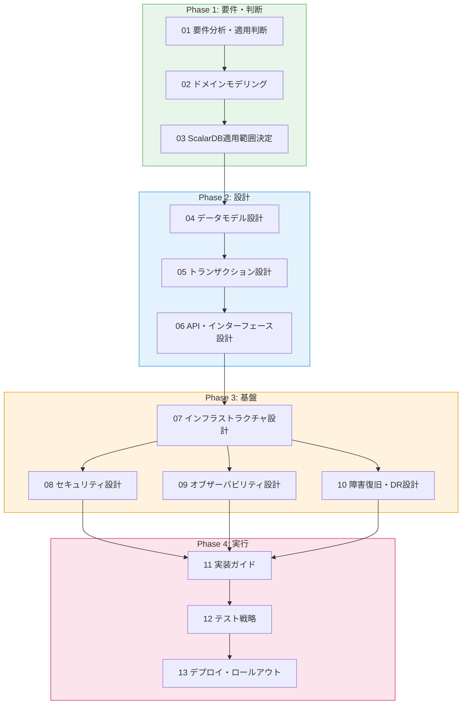

# ScalarDB × マイクロサービス 実装計画プロジェクト

ScalarDB Cluster (v3.17) を活用したマイクロサービスアーキテクチャの実装計画を、4フェーズ・13ステップのワークフローで段階的に策定する Claude Code プロジェクト。

## 前提条件

- [Claude Code](https://docs.anthropic.com/en/docs/claude-code) がインストールされていること

## クイックスタート

```bash
# プロジェクトディレクトリで Claude Code を起動
claude

# ワークフローの進捗確認と次ステップの提案
/plan

# Step 01 から実行開始
/plan-step 01
```

## ディレクトリ構成

```
.
├── CLAUDE.md              # プロジェクトルール（Claude Code が自動読み込み）
├── README.md              # 本ファイル
├── research/              # 調査フェーズの成果物（16ドキュメント、読み取り専用）
├── workflow/              # ワークフロー定義（13ステップ + テンプレート、読み取り専用）
├── output/                # ワークフロー実行で生成される成果物
│   ├── phase1/            #   Step 01-03: 要件・判断 + review_report.md
│   ├── phase2/            #   Step 04-06: 設計 + review_report.md
│   ├── phase3/            #   Step 07-10: 基盤 + review_report.md
│   ├── phase4/            #   Step 11-13: 実行 + review_report.md
│   └── final_review_report.md  # クロスフェーズ最終レビュー
├── skills/                # エージェント用リファレンススキル（7スキル）
├── agents/                # カスタムエージェント定義（10エージェント）
└── .claude/commands/      # スラッシュコマンド定義
```

## ワークフロー



Phase 3 の Step 08〜10 は並列実行が可能。

## スラッシュコマンド

| コマンド | 説明 |
|---------|------|
| `/plan` | ワークフロー全体の管理。進捗確認と次ステップの提案 |
| `/plan-step <N>` | ステップ N（01〜13）を実行 |
| `/plan-review <phase>` | フェーズ（phase1〜phase4）の5パースペクティブ並列レビュー |
| `/plan-review final` | 全13ステップ完了後のクロスフェーズ最終レビュー |
| `/plan-status` | 全体の進捗状況をダッシュボード表示 |

### 使用例

```
# 金融系決済サービスの要件でStep 01を実行
/plan-step 01

金融系の決済サービスを開発中です。
MySQL と DynamoDB を使用しており、決済処理と口座管理間で
ACID トランザクションが必要です。
```

## 調査資料（research/）

ワークフローの入力となる事前調査レポート。各ステップから参照される。

| # | ファイル | 内容 |
|---|---------|------|
| 00 | `summary_report.md` | ScalarDB 全体像サマリー |
| 01 | `microservice_architecture.md` | MSA パターン、サービス分割戦略 |
| 02 | `scalardb_usecases.md` | ユースケース、デシジョンツリー |
| 03 | `logical_data_model.md` | 論理データモデルパターン |
| 04 | `physical_data_model.md` | PK/CK/SI 設計、パフォーマンス |
| 05 | `database_investigation.md` | 対応 DB 一覧、特性比較 |
| 06 | `infrastructure_prerequisites.md` | K8s 要件、リソース制約 |
| 07 | `transaction_model.md` | トランザクションパターン |
| 08 | `transparent_data_access.md` | CDC、Analytics、ハイブリッド |
| 09 | `batch_processing.md` | バッチ処理パターン |
| 10 | `security.md` | 認証・認可、暗号化、監査 |
| 11 | `observability.md` | メトリクス、ログ、分散トレーシング |
| 12 | `disaster_recovery.md` | バックアップ、リストア、フェイルオーバー |
| 13 | `scalardb_317_deep_dive.md` | v3.17 固有機能・制約 |
| 14 | `review_report.md` | 調査レビュー結果 |
| 15 | `xa_heterogeneous_investigation.md` | XA vs ScalarDB 比較 |

## エージェント構成

### ステップ実行エージェント

| エージェント | 対応ステップ | 役割 |
|-------------|------------|------|
| Requirements Analyst | 01, 03 | 要件分析、ScalarDB 適用判断 |
| ScalarDB Architect | 02, 04-06, 11-12 | ドメイン・データ・トランザクション・API 設計 |
| Infrastructure Designer | 07-10, 13 | インフラ・セキュリティ・監視・DR 設計 |

### レビューエージェント（5パースペクティブ並列レビュー）

各フェーズ完了時に5つの専門パースペクティブで並列にレビューし、統合レポートを生成する。

| エージェント | モデル | 観点 |
|-------------|-------|------|
| 整合性レビュー | sonnet | ドキュメント間トレーサビリティ、用語統一、図表参照整合性 |
| ScalarDB 技術レビュー | sonnet | ScalarDB 制約、2PC 範囲、OCC 競合率、v3.17 最適化 |
| 運用準備レビュー | sonnet | 監視3本柱、DR、セキュリティ、デプロイ安全性 |
| 分散システムリスクレビュー | opus | 分散モノリスリスク、障害モード、Saga 設計 |
| ビジネス要件レビュー | sonnet | 要件トレーサビリティ、NFR 定量化、ステークホルダー視点 |
| レビュー統合 | sonnet | 5パースペクティブの重複排除・重要度分類・判定算出 |

## レビューシステム

### フェーズレビュー（`/plan-review phase1` 〜 `phase4`）

5エージェントを並列起動し、統合レポート（`review_report.md`）を生成する。

| 判定 | 条件 |
|------|------|
| PASS | Critical: 0, Major: 0-2 |
| CONDITIONAL PASS | Critical: 0, Major: 3以上 |
| FAIL | Critical: 1以上 |

### 最終レビュー（`/plan-review final`）

全13ステップ・全4フェーズレビュー完了後に実行。クロスフェーズ横断で一貫性を検証し、`final_review_report.md` を生成する。

| 判定 | 条件 |
|------|------|
| GO | Critical: 0, Major: 0, 全フェーズ指摘解消済み |
| CONDITIONAL GO | Critical: 0, 未解消 Major あり（受容条件付き） |
| NO-GO | Critical: 1以上 |

## モデル選択

タスクの複雑さに応じてモデルを使い分け、トークン消費を最適化する。

| モデル | 用途 |
|-------|------|
| `haiku` | ステータス確認、テンプレート生成、フォーマット整形 |
| `sonnet` | 設計分析、ドキュメント生成、レビュー実行（4エージェント） |
| `opus` | アーキテクチャ判断、トレードオフ評価、分散システムリスクレビュー |
