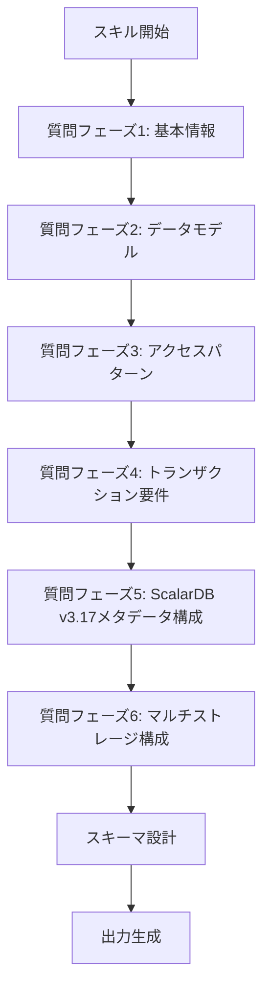
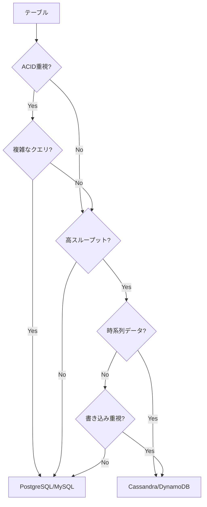
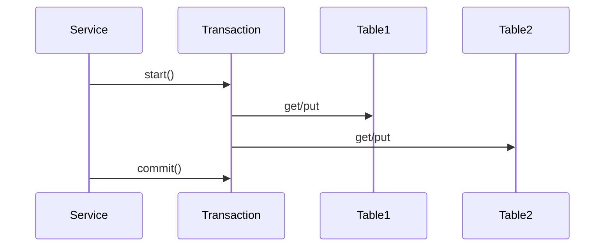

# Database Design Skill

## 目的

ScalarDBを使用したデータベース設計を行い、以下を生成します：

- スキーマ設計書（テーブル定義、キー設計）
- トランザクション設計書（パターン、分離レベル）
- ScalarDBスキーマファイル（schema.json）
- ScalarDB設定ファイル（scalardb.properties）

---

## リファレンス資料

設計にあたっては、以下の資料を参照してください：

| 資料 | パス | 参照内容 |
|------|------|---------|
| 論理データモデルパターン | `research/03_logical_data_model.md` | エンティティ設計、正規化、リレーション |
| 物理データモデル・PK/CK設計 | `research/04_physical_data_model.md` | パーティションキー、クラスタリングキー、インデックス戦略 |
| 対応DB一覧 | `research/05_database_investigation.md` | サポートDB、機能制約、データ型マッピング |
| v3.17メタデータ分離 | `research/13_scalardb_317_deep_dive.md` | Transaction Metadata Decoupling、メタデータテーブル設計 |
| 設計手順 | `workflow/04_data_model_design.md` | ステップバイステップの設計プロセス |
| 設計テンプレート | `workflow/templates/data_model_template.md` | 設計書のテンプレート |

---

## 実行フロー



---

## Stage 1: 要件ヒアリング

### 1.1 質問フェーズ1: 基本情報

| 質問項目 | 説明 | 例 |
|---------|------|-----|
| プロジェクト名 | システム識別名 | pce-backend |
| サービス一覧 | マイクロサービス名 | audit, verification, event |
| バックエンドDB | 使用するストレージ | PostgreSQL, Cassandra |
| マルチテナント | テナント分離要否 | Yes / No |
| ScalarDBバージョン | 使用バージョン | v3.17以降 / v3.16以前 |

**質問例**:
```
プロジェクト名を教えてください。
どのようなサービス（マイクロサービス）がありますか？
バックエンドデータベースは何を使用しますか？
  1. PostgreSQL
  2. MySQL
  3. Cassandra
  4. DynamoDB
  5. 複数DB（マルチストレージ）
マルチテナント対応は必要ですか？
ScalarDBのバージョンはv3.17以降ですか？
```

### 1.2 質問フェーズ2: データモデル

| 質問項目 | 説明 | デフォルト |
|---------|------|-----------|
| エンティティ一覧 | 主要なエンティティ | - |
| エンティティ属性 | 各エンティティの属性 | - |
| 関連 | エンティティ間の関係 | - |

**質問例**:
```
主要なエンティティ（テーブル）を教えてください。
各エンティティにはどのような属性がありますか？
エンティティ間の関連（1対多、多対多など）を教えてください。
```

**参照**: `research/03_logical_data_model.md` の論理データモデルパターンを参照

### 1.3 質問フェーズ3: アクセスパターン

| 質問項目 | 説明 | 例 |
|---------|------|-----|
| 主要クエリ | 頻繁に実行するクエリ | ID検索、一覧取得 |
| 検索条件 | フィルタ条件 | ステータス、日付範囲 |
| ソート順 | 並び順 | 作成日時降順 |

**質問例**:
```
主要なクエリパターンを教えてください：
  - どのような条件で検索しますか？
  - どのような順序でデータを取得しますか？
  - 範囲検索は必要ですか？
```

**参照**: `research/04_physical_data_model.md` のアクセスパターンとキー設計を参照

### 1.4 質問フェーズ4: トランザクション要件

| 質問項目 | 説明 | デフォルト |
|---------|------|-----------|
| トランザクション境界 | 同時更新が必要なテーブル | - |
| 整合性要件 | 強整合性が必要な操作 | SERIALIZABLE |
| サービス間連携 | 分散トランザクション要否 | No |

**質問例**:
```
複数テーブルを同時に更新する操作はありますか？
強い整合性が必要な操作はどれですか？
サービス間をまたぐトランザクションは必要ですか？
  1. 不要（単一サービス内で完結）
  2. 必要（Saga パターン使用）
  3. 必要（分散トランザクション）
```

### 1.5 質問フェーズ5: ScalarDB v3.17メタデータ構成

ScalarDB v3.17以降を使用する場合、Transaction Metadata Decouplingの構成を決定します。

| 質問項目 | 説明 | デフォルト |
|---------|------|-----------|
| メタデータ分離 | メタデータテーブルを別DBに配置 | No |
| メタデータDB | メタデータ用のストレージ | 同一DB |
| コーディネーター配置 | coordinatorテーブルの配置先 | 同一DB |

**質問例**:
```
ScalarDB v3.17のTransaction Metadata Decouplingを使用しますか？
  1. 使用しない（従来通りビジネステーブルと同じDBに配置）
  2. 使用する（メタデータテーブルを別DBに分離）

メタデータテーブル（transaction_metadata, coordinator）を別DBに配置しますか？
  理由：
  - パフォーマンスの分離（ビジネステーブルとメタデータの負荷分離）
  - コスト最適化（高性能DBとコスト効率の良いDBの使い分け）
  - 運用の簡素化（メタデータのバックアップ・メンテナンス分離）

メタデータ用のストレージは何を使用しますか？
  1. PostgreSQL（ACID重視、管理容易）
  2. MySQL（一般的なRDB）
  3. Cassandra（高スケーラビリティ）
  4. DynamoDB（サーバーレス）
```

**参照**: `research/13_scalardb_317_deep_dive.md` の詳細な分析を参照

**メタデータ分離の判断基準**:

| 状況 | 推奨構成 | 理由 |
|------|---------|------|
| 小規模システム（~100 TPS） | 分離しない | 運用がシンプル、オーバーヘッド最小 |
| 中規模システム（100-1000 TPS） | 状況に応じて | 負荷状況により判断 |
| 大規模システム（1000+ TPS） | 分離する | パフォーマンス分離、スケーラビリティ向上 |
| マルチストレージ構成 | 分離を検討 | メタデータを統一的に管理 |
| コスト重視 | 分離する | 高性能DBとコスト効率DBの使い分け |

### 1.6 質問フェーズ6: マルチストレージ構成

複数のバックエンドDBを使用する場合、テーブルごとの配置を決定します。

| 質問項目 | 説明 | 例 |
|---------|------|-----|
| ストレージ一覧 | 使用するDB | postgresql, cassandra |
| テーブル配置戦略 | どのテーブルをどのDBに配置するか | トランザクション重視→PostgreSQL、イベント→Cassandra |
| デフォルトストレージ | 明示的に指定しない場合のDB | postgresql |

**質問例**:
```
複数のバックエンドDBを使用しますか？

各テーブルをどのストレージに配置しますか？
判断基準：
  1. PostgreSQL/MySQL → ACID重視、複雑なクエリ、中小規模
  2. Cassandra → 高スケーラビリティ、書き込み重視、イベントログ
  3. DynamoDB → サーバーレス、自動スケーリング

デフォルトストレージ（明示的に指定しないテーブル用）はどれですか？
```

**配置戦略の例**:

| テーブル種別 | 推奨ストレージ | 理由 |
|------------|-------------|------|
| トランザクションテーブル | PostgreSQL/MySQL | ACID保証、結合クエリ |
| イベントログテーブル | Cassandra/DynamoDB | 高スループット、時系列データ |
| 監査ログテーブル | Cassandra/DynamoDB | 追記のみ、長期保存 |
| マスターテーブル | PostgreSQL/MySQL | 参照整合性、更新頻度低 |
| メタデータテーブル | PostgreSQL/MySQL | トランザクション制御、一貫性 |

**参照**: `research/05_database_investigation.md` の各DBの特性を参照

---

## Stage 2: スキーマ設計

### 2.1 ネームスペース設計

サービス別にネームスペースを分離:

```
{project}/
├── {service1}/
│   ├── {entity1}
│   └── {entity2}
├── {service2}/
│   └── {entity3}
└── coordinator/
    └── state (Sagaパターン使用時)
```

**v3.17以降のメタデータテーブル**:
- `scalardb.metadata.transaction_metadata` (メタデータ分離時)
- `scalardb.metadata.coordinator` (メタデータ分離時)

### 2.2 テーブル設計

**キー選定基準**:

| キータイプ | 選定基準 | 詳細 |
|-----------|---------|------|
| パーティションキー | カーディナリティが高い属性（ID、テナントID等） | `research/04_physical_data_model.md` 参照 |
| クラスタリングキー | 範囲クエリ・ソートに使用する属性 | 時系列データ、バージョン等 |
| セカンダリインデックス | 頻繁な検索条件（注意: パフォーマンス影響あり） | 最小限に抑える |

**テーブル定義テンプレート**:

```json
{
  "{namespace}.{table}": {
    "transaction": true,
    "partition-key": ["{partition_key}"],
    "clustering-key": ["{clustering_key}"],
    "clustering-order": {"{clustering_key}": "ASC|DESC"},
    "columns": {
      "{column}": "{type}"
    },
    "secondary-index": ["{indexed_column}"]
  }
}
```

**参照**: `workflow/templates/data_model_template.md` のスキーマテンプレート

### 2.3 データ型マッピング

| ドメイン型 | ScalarDB型 | 備考 | 参照 |
|-----------|-----------|------|------|
| UUID | TEXT | 文字列として格納 | `research/05_database_investigation.md` |
| Enum | TEXT | 文字列として格納 | 同上 |
| 日時 | BIGINT | エポックミリ秒 | 同上 |
| 金額 | BIGINT | 最小単位（円、セント）で格納 | 同上 |
| JSON | TEXT | シリアライズして格納 | 同上 |
| ファイル | BLOB | バイナリとして格納 | 同上 |

**注意**: バックエンドDBによってサポートされる型が異なります。詳細は `research/05_database_investigation.md` を参照。

### 2.4 逆引きテーブル設計

マテリアライズドビューの代替として逆引きテーブルを作成:

```json
// 順方向: parent_id → children
{
  "children_by_parent": {
    "partition-key": ["parent_id"],
    "clustering-key": ["child_id"]
  }
}

// 逆方向: child_id → parent
{
  "parent_by_child": {
    "partition-key": ["child_id"],
    "columns": {
      "parent_id": "TEXT"
    }
  }
}
```

**参照**: `research/03_logical_data_model.md` の多対多リレーションパターン

---

## Stage 3: トランザクション設計

### 3.1 トランザクションパターン

| パターン | 適用条件 | 実装 |
|---------|---------|------|
| 単一テーブル | 1テーブルのみ更新 | 通常のput/delete |
| 複数テーブル | 同一サービス内の複数テーブル | 単一トランザクション |
| Saga | サービス間連携 | 補償トランザクション |

### 3.2 分離レベル選択

| 操作タイプ | 推奨分離レベル |
|-----------|--------------|
| 作成・更新・削除 | SERIALIZABLE |
| 参照のみ（一覧取得等） | SNAPSHOT |
| レポート・分析 | SNAPSHOT（または非トランザクション） |

### 3.3 リトライ戦略

```java
RetryTemplate.builder()
    .maxAttempts(3)
    .exponentialBackoff(100, 2, 1000)
    .retryOn(CrudConflictException.class)
    .retryOn(TransactionRetryableException.class)
    .build();
```

---

## Stage 4: ScalarDB v3.17メタデータ構成設計

### 4.1 メタデータテーブルの理解

ScalarDB v3.17以降では、トランザクションメタデータを分離できます：

**メタデータテーブル**:
1. `transaction_metadata` - トランザクションの状態管理
2. `coordinator` - 2PCのコーディネーター情報

**従来（v3.16以前）**:
- ビジネステーブルごとに`tx_id`, `tx_state`, `tx_version`等のカラムが追加される
- メタデータがビジネスデータと混在

**v3.17以降（メタデータ分離）**:
- メタデータが専用テーブルに分離
- ビジネステーブルは純粋なビジネスデータのみ
- メタデータテーブルを別DBに配置可能

### 4.2 メタデータ分離の設計判断

**メタデータを分離する場合の設定**:

```properties
# メタデータストレージの指定
scalar.db.transaction.metadata.storage=metadata_storage

# メタデータストレージの定義
scalar.db.storage.metadata_storage.type=jdbc
scalar.db.storage.metadata_storage.contact_points=jdbc:postgresql://metadata-db:5432/scalardb_metadata
scalar.db.storage.metadata_storage.username=metadata_user
scalar.db.storage.metadata_storage.password=metadata_pass

# ビジネスデータストレージ
scalar.db.storage.type=jdbc
scalar.db.storage.contact_points=jdbc:postgresql://business-db:5432/business_db
```

**メリット**:
- パフォーマンス分離（メタデータアクセスの負荷がビジネスDBに影響しない）
- コスト最適化（メタデータは低コストDBに、ビジネスは高性能DBに）
- 運用の簡素化（メタデータのバックアップ・メンテナンスを独立管理）

**デメリット**:
- 構成の複雑化
- ネットワークレイテンシーの増加（別DBへのアクセス）
- 運用管理対象の増加

**参照**: `research/13_scalardb_317_deep_dive.md` の詳細分析

---

## Stage 5: マルチストレージ設計（オプション）

### 5.1 ストレージ選定基準

| ストレージ | 適用場面 | 特性 |
|-----------|---------|------|
| PostgreSQL | ACID重視、複雑なクエリ、小〜中規模 | トランザクション処理、結合クエリ |
| MySQL | ACID重視、一般的なWebアプリ | 広く普及、管理容易 |
| Cassandra | 高スケーラビリティ、書き込み重視 | イベントログ、時系列データ |
| DynamoDB | サーバーレス、自動スケーリング | 完全マネージド、従量課金 |

**参照**: `research/05_database_investigation.md` の各DBの詳細比較

### 5.2 テーブル配置戦略

**配置の決定フロー**:



**配置例**:

| サービス | テーブル | ストレージ | 理由 |
|---------|---------|----------|------|
| order | orders | PostgreSQL | トランザクション処理、ACID保証 |
| order | order_items | PostgreSQL | 親テーブルと同一DB（結合クエリ） |
| event | events | Cassandra | 高スループット、時系列データ |
| audit | audit_logs | Cassandra | 追記のみ、長期保存 |
| metadata | transaction_metadata | PostgreSQL | トランザクション制御 |

### 5.3 マッピング設定

```properties
# ストレージ定義
scalar.db.multi_storage.storages=postgresql,cassandra

# PostgreSQL設定
scalar.db.multi_storage.storages.postgresql.storage=jdbc
scalar.db.multi_storage.storages.postgresql.contact_points=jdbc:postgresql://postgres:5432/business
scalar.db.multi_storage.storages.postgresql.username=postgres
scalar.db.multi_storage.storages.postgresql.password=postgres

# Cassandra設定
scalar.db.multi_storage.storages.cassandra.storage=cassandra
scalar.db.multi_storage.storages.cassandra.contact_points=cassandra:9042
scalar.db.multi_storage.storages.cassandra.username=cassandra
scalar.db.multi_storage.storages.cassandra.password=cassandra

# ネームスペースマッピング
scalar.db.multi_storage.namespace_mapping=order:postgresql,event:cassandra,audit:cassandra

# デフォルトストレージ
scalar.db.multi_storage.default_storage=postgresql

# メタデータストレージ（v3.17以降）
scalar.db.transaction.metadata.storage=postgresql
```

---

## Stage 6: 出力

### 6.1 出力ファイル

```
output/phase2/
└── 04_data_model_design.md         # データモデル設計書（統合）
    ├── 1. 概要
    ├── 2. ネームスペース構成
    ├── 3. テーブル定義
    ├── 4. アクセスパターン
    ├── 5. トランザクション設計
    ├── 6. ScalarDB v3.17メタデータ構成
    ├── 7. マルチストレージ構成
    └── 添付: schema.json, scalardb.properties
```

### 6.2 設計書テンプレート

**output/phase2/04_data_model_design.md**:

```markdown
# データモデル設計書

## 1. 概要

| 項目 | 値 |
|------|-----|
| プロジェクト | {projectName} |
| バックエンドDB | {databases} |
| マルチテナント | {multiTenant} |
| ScalarDBバージョン | {scalardbVersion} |
| メタデータ分離 | {metadataDecoupling} |

## 2. ネームスペース構成

| ネームスペース | サービス | テーブル数 | ストレージ |
|--------------|---------|----------|----------|
| {namespace} | {service} | {count} | {storage} |

## 3. テーブル定義

### 3.1 {namespace}.{table}

| 項目 | 値 |
|------|-----|
| 説明 | {description} |
| ストレージ | {storage} |
| パーティションキー | {partitionKey} |
| クラスタリングキー | {clusteringKey} |
| セカンダリインデックス | {secondaryIndex} |

**カラム定義**:

| カラム | 型 | 説明 | 制約 |
|--------|-----|------|------|
| {column} | {type} | {description} | {constraints} |

**設計根拠**:
- パーティションキー選定理由: {reason}
- クラスタリングキー選定理由: {reason}
- ストレージ選定理由: {reason}

## 4. アクセスパターン

| パターンID | パターン | テーブル | クエリ | 頻度 | パフォーマンス |
|-----------|---------|---------|-------|------|--------------|
| {id} | {pattern} | {table} | {query} | {frequency} | {performance} |

**クエリ例**:
```java
// {patternDescription}
{queryExample}
```

## 5. トランザクション設計

### 5.1 トランザクション一覧

| 操作 | パターン | テーブル | 分離レベル | 推定TPS |
|------|---------|---------|-----------|---------|
| {operation} | {pattern} | {tables} | {isolation} | {tps} |

### 5.2 トランザクション詳細

#### 5.2.1 {operationName}

**概要**: {description}

**対象テーブル**:
- {table1}
- {table2}

**シーケンス**:



**例外処理**:

| 例外 | 対応 |
|------|------|
| {exception} | {handling} |

**リトライ戦略**: {retryStrategy}

## 6. ScalarDB v3.17メタデータ構成

### 6.1 メタデータ分離設定

| 項目 | 値 |
|------|-----|
| メタデータ分離 | {enabled/disabled} |
| メタデータストレージ | {storage} |
| ビジネスストレージ | {storage} |

**設計判断**:
{decisionRationale}

**メタデータテーブル配置**:

| テーブル | ストレージ | 理由 |
|---------|----------|------|
| transaction_metadata | {storage} | {reason} |
| coordinator | {storage} | {reason} |

**設定ファイル**:
```properties
# メタデータ分離設定
{metadataConfig}
```

**参照**: `research/13_scalardb_317_deep_dive.md`

## 7. マルチストレージ構成

### 7.1 ストレージ一覧

| ストレージID | タイプ | 用途 | 接続情報 |
|------------|------|------|---------|
| {id} | {type} | {purpose} | {connection} |

### 7.2 テーブル配置マップ

| ネームスペース | テーブル | ストレージ | 配置理由 |
|--------------|---------|----------|---------|
| {namespace} | {table} | {storage} | {reason} |

### 7.3 マッピング設定

```properties
# マルチストレージ設定
{multiStorageConfig}
```

**配置戦略の根拠**:
{strategyRationale}

**参照**: `research/05_database_investigation.md`

## 8. 逆引きテーブル

| 元テーブル | 逆引きテーブル | 用途 | 整合性維持方法 |
|-----------|--------------|------|--------------|
| {source} | {reverse} | {purpose} | {consistency} |

## 9. パフォーマンス考慮事項

### 9.1 ボトルネック分析

| 懸念事項 | 影響 | 対策 |
|---------|------|------|
| {concern} | {impact} | {mitigation} |

### 9.2 スケーラビリティ

| 項目 | 現状 | 目標 | スケーリング戦略 |
|------|------|------|---------------|
| {item} | {current} | {target} | {strategy} |

## 10. 設計レビューチェックリスト

- [ ] パーティションキーのカーディナリティは十分か
- [ ] クラスタリングキーはアクセスパターンに合致しているか
- [ ] セカンダリインデックスは最小限か
- [ ] トランザクション境界は適切か
- [ ] メタデータ分離の判断は妥当か
- [ ] マルチストレージの配置は最適か
- [ ] 逆引きテーブルの整合性維持方法は明確か

## 添付ファイル

### A. schema.json

```json
{schemaJson}
```

### B. scalardb.properties

```properties
{scalardbProperties}
```
```

**参照**: `workflow/templates/data_model_template.md` の詳細テンプレート

---

## 使用例

### 例1: 基本的な使い方

```
Skill: database-design

プロジェクト名: pce-backend
サービス: audit, verification, event
バックエンドDB: PostgreSQL
ScalarDBバージョン: v3.17
```

### 例2: マルチストレージ構成

```
Skill: database-design

プロジェクト名: enterprise-platform
サービス: order, inventory, analytics
バックエンドDB: PostgreSQL + Cassandra
マルチテナント: Yes
メタデータ分離: Yes（PostgreSQLに配置）
```

### 例3: メタデータ分離構成

```
Skill: database-design

プロジェクト名: high-scale-platform
サービス: transaction, event
バックエンドDB: Cassandra
メタデータDB: PostgreSQL（分離）
理由: Cassandraの高スループットとPostgreSQLの強整合性を組み合わせ
```

### 例4: ドメインモデルからの設計

```
Skill: database-design

プロジェクト名: pce-backend
ドメインモデル: output/phase2/03_domain_model.md
設計手順に従って対話的に設計を進める
```

---

## 注意事項

### 一般的な注意事項

- ScalarDBのセカンダリインデックスはパフォーマンスに影響するため、必要最小限に
- タイムスタンプはBIGINT（エポックミリ秒）で格納を推奨
- マルチテナントの場合、パーティションキーにtenant_idを含める
- 逆引きテーブルは両方向のデータ整合性を維持する必要あり

### ScalarDB v3.17固有の注意事項

- メタデータ分離を有効にする場合、メタデータストレージの可用性が全体の可用性に影響
- メタデータテーブルへのアクセスは頻繁に発生するため、レイテンシーに注意
- v3.16以前からのマイグレーションではスキーマ変更が必要
- メタデータ分離の有効化後は元に戻すのが困難

### マルチストレージ固有の注意事項

- クロスストレージの結合クエリは実行できない
- 各ストレージの制約（データ型、インデックス等）を考慮
- ストレージ間のレイテンシー差に注意
- トランザクションは複数ストレージにまたがることが可能だが、パフォーマンスに影響

### 設計のベストプラクティス

1. **アクセスパターン優先**: スキーマはクエリパターンから逆算して設計
2. **シンプルさ重視**: 複雑な設計は運用負荷を増加させる
3. **段階的な最適化**: 初期は単純な構成から始め、必要に応じて最適化
4. **ドキュメント重視**: 設計判断の根拠を明確に記録
5. **レビューの実施**: 設計完了後、チェックリストに基づいてレビュー

---

## 参照ワークフロー

設計の詳細な手順については、以下を参照してください：

- `workflow/04_data_model_design.md` - データモデル設計のステップバイステップ手順
- `workflow/templates/data_model_template.md` - 設計書の詳細テンプレート

---

## 更新履歴

| 日付 | バージョン | 変更内容 |
|------|----------|---------|
| 2026-02-17 | 1.0 | ScalarDB固有の設計スキルとして作成、v3.17対応、マルチストレージ強化 |
