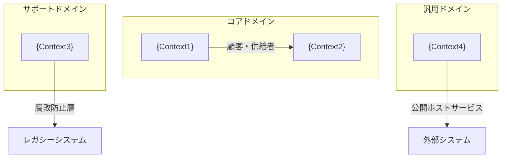
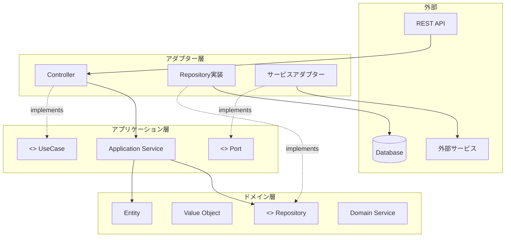

# Domain Modeling Skill

## 目的

DDDの原則に基づいてドメインモデルを設計し、以下を生成します：

- **戦略的設計**
  - 境界コンテキストの定義
  - コンテキストマップの作成
  - ユビキタス言語の整備

- **戦術的設計**
  - 値オブジェクトの設計
  - エンティティの設計
  - 集約とリポジトリの定義
  - ドメインサービスの設計
  - ドメインイベントの定義
  - ファクトリの設計

- **アーキテクチャ統合**
  - ヘキサゴナルアーキテクチャへのマッピング
  - ScalarDB統合考慮事項

## リファレンス資料

設計にあたっては、以下のアーキテクチャ資料を参照してください：

| 資料 | パス | 参照内容 |
|------|------|---------|
| DDD戦略・戦術ガイド | `assets/ddd-strategic-tactical-guide.md` | 戦略・戦術的設計パターン、評価基準 |
| DDD・マイクロサービス | `assets/ddd-and-microservices-architecture.md` | 統合パターン、実装例、ScalarDB適用 |
| Work Directoryパターン | `assets/work-directory-pattern.md` | 中間状態管理 |

### ローカルワークフロー・調査資料

| 資料 | パス | 参照内容 |
|------|------|---------|
| ドメインモデリング手順 | `workflow/02_domain_modeling.md` | ステップバイステップのドメインモデリング手順 |
| マイクロサービスアーキテクチャ調査 | `research/01_microservice_architecture.md` | MSAパターン、サービス分割戦略 |
| 論理データモデル調査 | `research/03_logical_data_model.md` | データモデルパターン、正規化戦略 |

### 参照すべきセクション

1. **境界コンテキスト設計時**: 戦略・戦術ガイドの「1.3 境界コンテキスト」「1.5 コンテキストマップ統合パターン」
2. **値オブジェクト設計時**: 戦略・戦術ガイドの「2.1 値オブジェクト」
3. **集約設計時**: 戦略・戦術ガイドの「2.3 集約」
4. **アーキテクチャ設計時**: 戦略・戦術ガイドの「3. ヘキサゴナルアーキテクチャとの統合」

---

## 実行フロー

### Stage 0: 初期化

1. **Work Directoryの準備**
   ```
   research/ の確認
   _state.md の初期化（または既存状態の読み込み）
   再開判定: 前回中断があれば途中から再開
   ```

2. **出力ディレクトリの準備**
   - `output/phase1/`

3. **状態ファイルの作成**

   **状態ファイル例 (research/_state.md)**:
   ```markdown
   # 処理状態: domain-modeling

   ## メタ情報

   | 項目 | 値 |
   |------|-----|
   | スキル | domain-modeling |
   | 開始時刻 | {timestamp} |
   | 最終更新 | {timestamp} |
   | 状態 | in_progress |
   | 現在のステージ | Stage 0 |

   ## パラメータ

   | パラメータ | 値 |
   |-----------|-----|
   | architecturePattern | hexagonal |
   | 入力ソース | research/01_microservice_architecture.md, research/03_logical_data_model.md |
   ```

---

### Stage 1: 入力の解析

#### 入力パラメータ

| パラメータ | 必須 | 説明 | デフォルト |
|-----------|------|------|-----------|
| architecturePattern | No | アーキテクチャパターン | hexagonal |
| investigationDocs | No | 調査資料パス | research/ |

#### 入力ソース

1. **マイクロサービスアーキテクチャ調査**: `research/01_microservice_architecture.md`
2. **論理データモデル調査**: `research/03_logical_data_model.md`
3. **ユーザー指定**: 新規設計の場合

---

### Stage 2: 戦略的設計

#### 2.1 ユビキタス言語の確立

**用語辞書テンプレート**:
```yaml
ubiquitous_language:
  context: "{context_name}"
  terms:
    - term: "{日本語用語}"
      english: "{EnglishTerm}"
      definition: "{ビジネス定義}"
      code_representation:
        class: "{ClassName}"
        methods: ["{methodName1}", "{methodName2}"]
      examples:
        - "{使用例1}"
        - "{使用例2}"
      avoid:
        - term: "{避けるべき用語}"
          reason: "{理由}"
```

**実践ポイント**:
- すべてのクラス名、メソッド名、変数名にビジネス用語を使用
- 技術用語（Manager, Handler, Helper, Util）を避ける
- コードレビューで言語の一貫性を確認

#### 2.2 境界コンテキストの定義

**コンテキスト識別ロジック**:
```python
def identify_bounded_contexts(domain_terms, use_cases):
    contexts = []

    # 関連性の高い用語をグループ化
    term_clusters = cluster_related_terms(domain_terms)

    for cluster in term_clusters:
        context = {
            "name": derive_context_name(cluster),
            "responsibility": define_responsibility(cluster),
            "ubiquitous_language": cluster.terms,
            "aggregates": identify_aggregates(cluster),
            "domain_type": classify_domain(cluster)  # core/support/generic
        }
        contexts.append(context)

    return contexts
```

**コンテキスト設計テンプレート**:
```markdown
### 境界コンテキスト: {ContextName}

#### ドメインタイプ
- [ ] コアドメイン（組織をユニークにするもの）
- [ ] サポートサブドメイン（必要だが組織固有）
- [ ] 汎用サブドメイン（既製ソリューション推奨）

#### 責務
- {responsibility1}
- {responsibility2}

#### ユビキタス言語
| 用語 | 定義 | コード表現 |
|------|------|-----------|
| {term} | {definition} | {ClassName} |

#### 集約
- {Aggregate1}
- {Aggregate2}

#### 外部コンテキストとの関係
| コンテキスト | 関係パターン | 説明 |
|-------------|-------------|------|
| {OtherContext} | {pattern} | {description} |
```

#### 2.3 コンテキストマップの設計

**統合パターン選択ガイド**:

| 状況 | 推奨パターン | 説明 |
|------|------------|------|
| 密接に連携するチーム | パートナーシップ | 共同進化するインターフェース |
| 共通モデルがある | 共有カーネル | 相互相談が必要な共有コード |
| 明確な依存関係 | 顧客・供給者 | 上流が下流のニーズに対応 |
| 上流を変更できない | 順応者 | 下流が上流に従う |
| レガシーシステム連携 | 腐敗防止層 | 外部モデルから保護する抽象化層 |
| マイクロサービス公開 | 公開ホストサービス | オープンなプロトコル |
| 組織間統合 | 公表された言語 | 文書化された標準形式 |
| 統合不要 | 別々の道 | 独立した進化 |

**コンテキストマップテンプレート**:


---

### Stage 3: 戦術的設計 - 値オブジェクト

#### 3.1 値オブジェクトの識別基準

| 基準 | 説明 |
|------|------|
| **不変性** | 生成後に変更されない |
| **等価性** | 属性の組み合わせで比較される |
| **自己検証** | ビジネスロジックと検証をカプセル化 |
| **交換可能** | 同じ値なら交換可能 |
| **副作用なし** | メソッドは新しいインスタンスを返す |

#### 3.2 プリミティブ偏執症の解消

| 変換前 | 変換後 | 目的 |
|--------|--------|------|
| `String email` | `EmailAddress` | 形式検証、意味の明確化 |
| `String phoneNumber` | `PhoneNumber` | 形式検証 |
| `BigDecimal amount, String currency` | `Money` | 通貨計算のカプセル化 |
| `String postalCode, String city, ...` | `Address` | 住所の一貫した表現 |
| `long id / String id` | `TypedId<T>` | 型安全な識別子 |

#### 3.3 値オブジェクト設計テンプレート

```markdown
### 値オブジェクト: {ValueObjectName}

#### 目的
{purpose}

#### 属性

| 属性 | 型 | 検証ルール |
|------|-----|-----------|
| {attr} | {type} | {validation} |

#### 生成ルール
- {rule1}
- {rule2}

#### 操作

| メソッド | 説明 | 戻り値 |
|---------|------|--------|
| {method} | {description} | {return_type} |

#### 不変性保証
- すべてのフィールドはfinal/readonly
- 変更操作は新しいインスタンスを返す

#### コード例
```java
@Value
@Builder
public class {ValueObjectName} {
    private final {Type} {field};

    public {ValueObjectName}({Type} {field}) {
        // 検証
        if ({validation_condition}) {
            throw new IllegalArgumentException("{message}");
        }
        this.{field} = {field};
    }

    // 等価性は属性で比較（Lombokの@Valueで自動生成）

    // 変更操作は新しいインスタンスを返す
    public {ValueObjectName} with{Field}({Type} new{Field}) {
        return new {ValueObjectName}(new{Field});
    }
}
```
```

---

### Stage 4: 戦術的設計 - エンティティ

#### 4.1 エンティティの識別基準

| 基準 | 説明 |
|------|------|
| **ライフサイクル** | 生成・変更・削除のライフサイクルを持つ |
| **一意性** | IDで識別される |
| **可変性** | 状態が変化しうる |
| **同一性** | IDが同じなら同一（属性が異なっても） |

#### 4.2 貧血モデルの回避

**悪い例（貧血モデル）**:
```java
// setter/getterのみのデータ構造体
public class Order {
    private OrderStatus status;

    public void setStatus(OrderStatus status) {
        this.status = status;
    }
}
```

**良い例（リッチドメインモデル）**:
```java
// ビジネス操作を公開
public class Order {
    private OrderStatus status;

    public void approve() {
        if (status != OrderStatus.PENDING) {
            throw new IllegalStateException("承認できるのは保留中の注文のみ");
        }
        this.status = OrderStatus.APPROVED;
    }

    public void reject(String reason) {
        // ビジネスロジック
    }

    public void cancel() {
        // ビジネスロジック
    }
}
```

#### 4.3 エンティティ設計テンプレート

```markdown
### エンティティ: {EntityName}

#### 識別子
- 型: {IdType}（値オブジェクト推奨）
- 生成戦略: {UUID/シーケンス/複合キー}

#### 属性

| 属性 | 型 | 説明 | 可変性 |
|------|-----|------|--------|
| id | {IdType} | 識別子 | 不変 |
| {attr} | {Type} | {desc} | {mutable/immutable} |

#### ビジネス操作

| 操作 | 説明 | 事前条件 | 事後条件 | 発行イベント |
|------|------|---------|---------|-------------|
| {operation} | {description} | {precondition} | {postcondition} | {event} |

#### 不変条件
- {invariant1}
- {invariant2}

#### コード例
```java
public class {EntityName} {
    private final {IdType} id;
    private {Type} {field};

    // ビジネス操作として公開
    public void {operation}({params}) {
        // 事前条件チェック
        if (!{precondition}) {
            throw new {BusinessException}("{message}");
        }

        // 状態変更
        this.{field} = {newValue};

        // ドメインイベント発行
        registerEvent(new {EventName}(this.id, ...));
    }

    // IDで等価性を判断
    @Override
    public boolean equals(Object o) {
        if (this == o) return true;
        if (!(o instanceof {EntityName})) return false;
        return id.equals((({EntityName}) o).id);
    }
}
```
```

---

### Stage 5: 戦術的設計 - 集約

#### 5.1 集約設計の原則

| 原則 | 説明 |
|------|------|
| **小さく保つ** | 理想は1エンティティ + 値オブジェクト群 |
| **集約ルート経由** | 外部からは集約ルートのみアクセス可能 |
| **ID参照** | 集約間の参照はIDで行う（直接参照しない） |
| **トランザクション境界** | 1トランザクション = 1集約 |
| **一貫性境界** | 集約内の不変条件は常に満たされる |

#### 5.2 集約ルートの識別

```python
def identify_aggregate_roots(entities):
    roots = []

    for entity in entities:
        # トランザクション境界となるか
        if is_transaction_boundary(entity):
            # 他から独立して存在できるか
            if can_exist_independently(entity):
                roots.append(entity)

    return roots
```

#### 5.3 集約設計テンプレート

```markdown
### 集約: {AggregateName}

#### 集約ルート
{AggregateRootEntity}

#### 構成要素

| 要素 | 種類 | 説明 |
|------|------|------|
| {RootEntity} | 集約ルート | {description} |
| {ChildEntity} | 子エンティティ | {description}（ローカルID） |
| {ValueObject} | 値オブジェクト | {description} |

#### クラス図

```mermaid
classDiagram
    class {RootEntity} {
        +{IdType} id
        -{List~ChildEntity~} children
        -{ValueObject} value
        +{operation1}()
        +{operation2}()
    }
    class {ChildEntity} {
        +LocalId id
        -{Type} field
    }
    class {ValueObject} {
        +{Type} attr
        +equals()
    }

    {RootEntity} "1" --> "*" {ChildEntity} : contains
    {RootEntity} "1" --> "1" {ValueObject} : has
```

#### 不変条件
- {invariant1}
- {invariant2}

#### トランザクション境界
- 集約内の変更は1トランザクションで完結
- 集約間の整合性はドメインイベントで担保

#### 他集約との関係

| 集約 | 参照方法 | 整合性 |
|------|---------|--------|
| {OtherAggregate} | ID参照 | 結果整合性 |
```

---

### Stage 6: 戦術的設計 - リポジトリ・サービス・イベント

#### 6.1 リポジトリ設計

**設計原則**:
- 集約ごとに1つのリポジトリ
- インターフェースはドメイン層に配置
- 実装はインフラストラクチャ層に配置
- コレクションのような振る舞い

**リポジトリテンプレート**:
```markdown
### リポジトリ: {AggregateRoot}Repository

#### インターフェース（ドメイン層）

```java
public interface {AggregateRoot}Repository {
    void save({AggregateRoot} aggregate);
    Optional<{AggregateRoot}> findById({IdType} id);
    List<{AggregateRoot}> findBy{Criteria}({CriteriaType} criteria);
    void delete({IdType} id);
}
```

#### 実装方針
- JPA/Hibernateベース
- 楽観的ロック（@Version）
- 集約全体の永続化
```

#### 6.2 ドメインサービス設計

**識別基準**:
- ステートレス
- 複数の集約にまたがる操作
- エンティティに属さないビジネスルール

**ドメインサービステンプレート**:
```markdown
### ドメインサービス: {ServiceName}Service

#### 責務
{responsibility}

#### 操作

| メソッド | 入力 | 出力 | 説明 |
|---------|------|------|------|
| {method} | {input} | {output} | {description} |

#### 依存
- {Repository1}
- {Repository2}
- {OtherDomainService}
```

#### 6.3 ドメインイベント設計

**イベント命名規則**:
- 過去形で表現（OrderPlaced, PaymentReceived）
- 集約名 + 動作名

**ドメインイベントテンプレート**:
```markdown
### ドメインイベント: {EventName}

#### トリガー
- 集約: {AggregateName}
- 操作: {operationName}()

#### ペイロード

| フィールド | 型 | 説明 |
|-----------|-----|------|
| eventId | UUID | イベントID |
| occurredAt | Timestamp | 発生日時 |
| aggregateId | {IdType} | 集約ID |
| {field} | {Type} | {description} |

#### 購読者

| 購読者 | アクション | トランザクション |
|--------|----------|----------------|
| {Subscriber1} | {action1} | 別トランザクション |
| {Subscriber2} | {action2} | 別トランザクション |
```

---

### Stage 7: ヘキサゴナルアーキテクチャ統合

#### 7.1 レイヤー構成

```
{context}/
├── domain/                    # ドメイン層（最内層）
│   ├── model/
│   │   ├── {aggregate}/
│   │   │   ├── {AggregateRoot}.java
│   │   │   ├── {ChildEntity}.java
│   │   │   ├── {ValueObject}.java
│   │   │   └── {AggregateRoot}Repository.java  # インターフェース
│   │   └── shared/
│   ├── service/
│   │   └── {DomainService}.java
│   └── event/
│       └── {DomainEvent}.java
│
├── application/               # アプリケーション層
│   ├── service/
│   │   └── {ApplicationService}.java
│   ├── port/
│   │   ├── in/               # インバウンドポート
│   │   │   └── {UseCase}.java
│   │   └── out/              # アウトバウンドポート
│   │       └── {Port}.java
│   └── dto/
│
├── infrastructure/            # インフラストラクチャ層（アダプター）
│   ├── persistence/
│   │   └── {Repository}Adapter.java
│   ├── messaging/
│   └── external/
│       └── {ExternalService}Adapter.java  # ACL
│
└── presentation/              # プレゼンテーション層（アダプター）
    └── rest/
        └── {Resource}Controller.java
```

#### 7.2 依存関係の方向



---

## ScalarDB 統合考慮事項

ScalarDBを利用する場合、以下の点を集約設計に反映する必要があります。

### 1. 集約境界 = ScalarDB トランザクション境界の原則

**原則**:
- 1つの集約 = 1つのScalarDBトランザクション単位
- 集約境界を超える操作は分散トランザクション（2PC）が必要
- 2PCは最大2-3サービスまでの制限を考慮

**設計への影響**:
```markdown
### 集約設計時のチェックリスト

- [ ] この集約は単一トランザクションで完結するか
- [ ] 他の集約との同期的な整合性が必要か
  - Yes → 2PCが必要（最大2-3サービス）
  - No → ドメインイベントで結果整合性
- [ ] 集約が大きすぎないか（トランザクションスコープが広すぎないか）
```

**例**:
```java
// 良い例: 単一集約のトランザクション
public class Order {
    public void placeOrder() {
        // 1つのScalarDBトランザクション内で完結
        this.status = OrderStatus.PLACED;
        this.items.forEach(item -> item.reserve());
    }
}

// 避けるべき例: 集約を跨ぐ同期処理
public class OrderService {
    public void placeOrder(Order order, Inventory inventory) {
        // 2つの集約を同期的に変更 → 2PCが必要
        order.placeOrder();      // 集約1
        inventory.reserve(...);  // 集約2
        // これは2つのサービスに分かれる可能性あり
    }
}

// 推奨: ドメインイベントによる結果整合性
public class Order {
    public void placeOrder() {
        this.status = OrderStatus.PLACED;
        registerEvent(new OrderPlaced(this.id, this.items));
        // Inventoryサービスがイベントを購読して在庫を確保
    }
}
```

### 2. ScalarDB管理テーブルと非管理テーブルの分類指針

**管理テーブル（ScalarDB管理下）**:
- トランザクション整合性が必要なデータ
- 集約ルートと子エンティティ
- 重要なビジネスデータ

**非管理テーブル（通常のRDBMS）**:
- 参照専用マスタデータ
- ログ・履歴データ（追記のみ）
- レポート用データ

**設計テンプレート**:
```markdown
### 集約: {AggregateName}

#### データ永続化戦略

| テーブル | 種別 | 理由 |
|---------|------|------|
| {aggregate_root_table} | ScalarDB管理 | トランザクション整合性が必要 |
| {child_entity_table} | ScalarDB管理 | 集約ルートと同一トランザクション |
| {reference_master} | 非管理 | 参照専用マスタ |
| {audit_log} | 非管理 | 追記のみの監査ログ |
```

### 3. 2PC適用範囲と集約設計の関係

**2PC制限事項**:
- 最大2-3サービス間でのみ利用可能
- パフォーマンスへの影響（通常のトランザクションより遅い）
- デッドロックのリスク

**設計ガイドライン**:

| シナリオ | 推奨アプローチ | 理由 |
|---------|--------------|------|
| 単一サービス内の複数集約 | ドメインイベント | 2PC不要、スケーラビリティ向上 |
| 2サービス間の同期更新 | 2PC可能 | 制限内、ただしパフォーマンス考慮 |
| 3サービス以上の同期更新 | Saga パターン | 2PC制限超過 |
| リアルタイム整合性不要 | ドメインイベント | 結果整合性で十分 |

**例**:
```markdown
### シナリオ: 注文処理

#### アプローチ1: 2PCを使用（2サービス）
- OrderService: 注文確定
- PaymentService: 決済処理
- 2PCで同期的に実行
- 制約: 在庫確保は別トランザクション（3サービス超過回避）

#### アプローチ2: Sagaパターン（3サービス以上）
1. OrderService: 注文作成（状態: PENDING）
2. PaymentService: 決済処理
3. InventoryService: 在庫確保
4. OrderService: 注文確定（状態: CONFIRMED）
   - いずれかのステップ失敗時は補償トランザクション
```

### 4. 集約間参照はID参照（ScalarDB跨ぎのJOIN不可）

**原則**:
- ScalarDBは分散環境を想定しているため、集約間のJOINは推奨されない
- 集約間の参照は必ずIDで行う
- 必要なデータは集約内に非正規化するか、CQRSパターンで読み取り用モデルを作成

**設計への影響**:
```java
// 悪い例: 直接参照（JOIN前提）
public class Order {
    private Customer customer;  // 他の集約への直接参照

    public String getCustomerName() {
        return customer.getName();  // JOIN必要
    }
}

// 良い例: ID参照
public class Order {
    private CustomerId customerId;  // ID参照
    private String customerName;     // 非正規化（頻繁にアクセスするデータ）

    public CustomerId getCustomerId() {
        return customerId;
    }

    public String getCustomerName() {
        return customerName;  // JOIN不要
    }
}

// または、CQRSで読み取り専用モデルを作成
public class OrderView {
    private OrderId orderId;
    private CustomerId customerId;
    private String customerName;
    private String customerEmail;
    // 結合済みデータ（読み取り最適化）
}
```

**設計テンプレート**:
```markdown
### 集約: Order

#### 他集約との参照

| 参照先集約 | 参照方法 | データ同期 |
|-----------|---------|-----------|
| Customer | CustomerId（ID参照） | customerName を非正規化、ドメインイベントで同期 |
| Product | ProductId（ID参照） | productName を非正規化、マスタ変更時にイベント |

#### 非正規化フィールド

| フィールド | 元データ | 同期方法 |
|-----------|---------|---------|
| customerName | Customer.name | CustomerUpdatedイベントを購読 |
| productName | Product.name | 注文確定時にスナップショット |
```

### 5. ScalarDB考慮の集約設計チェックリスト

```markdown
## ScalarDB 集約設計チェックリスト

### トランザクション境界
- [ ] 集約は単一ScalarDBトランザクションで完結するか
- [ ] 2PC適用が必要な場合、2-3サービス制限内か
- [ ] 3サービス以上の場合、Sagaパターンを検討したか

### データモデル
- [ ] 集約ルート・子エンティティはScalarDB管理テーブルか
- [ ] 参照専用データは非管理テーブルに分類したか
- [ ] 集約間参照はすべてID参照か

### 整合性戦略
- [ ] 即時整合性が必要な範囲を明確にしたか
- [ ] 結果整合性で十分な範囲を特定したか
- [ ] ドメインイベントの発行・購読を設計したか

### パフォーマンス
- [ ] 非正規化すべきフィールドを特定したか
- [ ] CQRS適用が必要な読み取りパターンを識別したか
- [ ] JOIN不要な設計になっているか
```

---

### Stage 8: 出力

#### 8.1 出力ファイル

**domain-model.md**:
```markdown
# ドメインモデル設計書

## 1. 戦略的設計

### 1.1 境界コンテキスト
{bounded_contexts}

### 1.2 コンテキストマップ
{context_map}

### 1.3 ユビキタス言語
{ubiquitous_language}

## 2. 戦術的設計

### 2.1 値オブジェクト
{value_objects}

### 2.2 エンティティ
{entities}

### 2.3 集約
{aggregates}

### 2.4 リポジトリ
{repositories}

### 2.5 ドメインサービス
{domain_services}

### 2.6 ドメインイベント
{domain_events}

## 3. アーキテクチャ

### 3.1 パッケージ構造
{package_structure}

### 3.2 依存関係図
{dependency_diagram}

## 4. ScalarDB統合

### 4.1 トランザクション境界
{transaction_boundaries}

### 4.2 管理テーブル分類
{table_classification}

### 4.3 2PC適用範囲
{two_phase_commit_scope}

### 4.4 集約間参照戦略
{cross_aggregate_references}

## 5. ユビキタス言語対応表

| 用語 | モデル要素 | 型 | コンテキスト |
|------|-----------|-----|------------|
| {term} | {element} | {type} | {context} |
```

**diagrams/**:
- `context-map.mmd`: コンテキストマップ
- `aggregate-{name}.mmd`: 各集約の構造図
- `domain-model.mmd`: ドメインモデル全体図

---

## 使用例

### 例1: 既存調査結果からの設計

```
Skill: domain-modeling

調査結果: research/01_microservice_architecture.md, research/03_logical_data_model.md
```

### 例2: 新規設計

```
Skill: domain-modeling

- 主要エンティティ:
  - ユーザー
  - 注文
  - 商品
- ビジネスルール:
  - 1ユーザーは複数注文可能
  - 注文は複数商品を含む
  - 注文確定後はキャンセルのみ可能
```

---

## 前提・連携スキル

| スキル | 種類 | 用途 |
|--------|------|------|
| investigation | 前提（任意） | システム調査結果 |
| module-design | 連携 | パッケージ構造の詳細設計 |
| database-design | 連携 | データベーススキーマ設計 |
| implementation-plan | 連携 | 実装タスクの生成 |

---

## 中間状態出力

各ステージの処理結果は `research/` ディレクトリに Markdown ファイルとして書き出されます：

```
research/
├── _state.md            # 全体進捗状態
├── context-analysis.md  # Stage 1 入力分析結果
├── strategic.md         # Stage 2 戦略的設計の中間結果
│   ├── ユビキタス言語
│   ├── 境界コンテキスト
│   └── コンテキストマップ
├── value-objects.md     # Stage 3-4 値オブジェクト設計
├── entities.md          # Stage 5 エンティティ設計
├── aggregates.md        # Stage 5 集約設計
├── domain-services.md   # Stage 6 ドメインサービス設計
├── events.md            # Stage 6 ドメインイベント設計
└── architecture.md      # Stage 7 アーキテクチャ統合
```

**中間結果ファイル例 (aggregates.md)**:
```markdown
# 集約設計 中間結果

## 更新日時
{timestamp}

## 集約一覧

### Order 集約

#### 集約ルート
- Order (OrderId で識別)

#### 子エンティティ
- OrderItem (ローカルID: itemIndex)

#### 値オブジェクト
- OrderStatus
- ShippingAddress
- Money (amount)

#### 不変条件
1. 注文金額 > 0
2. 最低1つの注文アイテムが必要
3. キャンセル済み注文は変更不可

#### ビジネス操作
| 操作 | 説明 | 事前条件 | 事後条件 |
|------|------|---------|---------|
| confirm() | 注文確定 | PENDING状態 | CONFIRMED状態 |
| cancel(reason) | 注文キャンセル | 未発送 | CANCELLED状態 |

#### ScalarDB考慮事項
- 単一トランザクション内で完結（2PC不要）
- order, order_items テーブルはScalarDB管理
- Customer集約へはID参照（customerIdフィールド）
- customerNameを非正規化（JOIN回避）

## 次ステップへの引き継ぎ
- 3つの集約を設計
- リポジトリインターフェースを定義
- ScalarDB管理/非管理テーブル分類完了
```

---

## 注意事項

- ユビキタス言語との整合性を常に確認してください
- 集約は小さく保つことを推奨します（1エンティティ + 値オブジェクト群が理想）
- 集約間の参照はIDで行い、直接参照は避けてください
- ドメインイベントは結果整合性の実現に重要です
- 貧血ドメインモデルを避け、ビジネスロジックをエンティティに持たせてください
- **ScalarDBの2PC制限（最大2-3サービス）を考慮した集約設計を行ってください**
- **集約境界 = ScalarDBトランザクション境界 の原則を守ってください**
- **集約間参照はID参照とし、JOIN不要な設計を心がけてください**
- research/ ディレクトリは `.gitignore` に追加することを推奨します
- 中断した場合、同じパラメータで再実行すると自動的に途中から再開します
