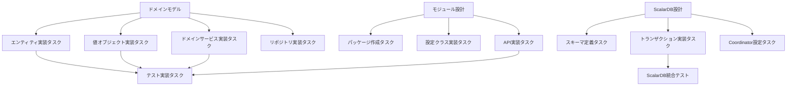
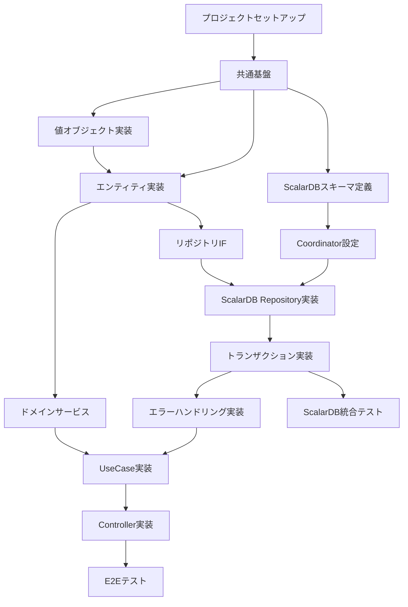

# Implementation Plan Skill

## 目的

設計ドキュメントを実装可能なタスクに分解し、以下を生成します：

- フェーズ別実装ロードマップ
- 個別タスク指示書（実装エージェント用）
- 依存関係を考慮した実行順序
- ScalarDB特有のテスト計画（2PC障害、OCC競合）

## リファレンス資料

タスク指示書の作成にあたっては、以下の資料を参照してください：

| 資料 | パス | 参照内容 |
|------|------|---------|
| Phase 1 設計書 | `output/phase1/` | 要求分析、ユースケース |
| Phase 2 設計書 | `output/phase2/` | ドメインモデル、境界づけられたコンテキスト |
| Phase 3 設計書 | `output/phase3/` | モジュール設計、API設計 |
| 実装ガイド | `workflow/11_implementation_guide.md` | 実装手順、ScalarDB実装パターン |

### 参照すべきセクション

1. **ScalarDBスキーマタスク作成時**: Phase 3設計書の「データモデル」セクション、実装ガイドの「ScalarDBスキーマ定義」
2. **トランザクション実装タスク作成時**: 実装ガイドの「ScalarDBトランザクション実装パターン」
3. **統合テスト計画作成時**: 実装ガイドの「ScalarDB統合テスト戦略」

---

## 実行フロー

### Stage 1: 入力の解析

#### 入力パラメータ

| パラメータ | 必須 | 説明 | デフォルト |
|-----------|------|------|-----------|
| projectName | Yes | プロジェクト名 | - |
| designDocs | Yes | 設計ドキュメントパス | output/ |
| targetLanguage | No | 実装言語 | java |
| framework | No | フレームワーク | spring-boot |
| testFramework | No | テストフレームワーク | junit5 |
| scalarDBVersion | No | ScalarDBバージョン | 3.x |

---

### Stage 2: 設計からタスクへの分解

#### 2.1 タスク識別ロジック



#### 2.2 タスクカテゴリ

| カテゴリ | 説明 | 優先度 |
|---------|------|--------|
| foundation | 基盤構築（プロジェクト構成、共通ライブラリ） | Phase 1 |
| domain | ドメイン層実装（エンティティ、値オブジェクト） | Phase 1 |
| scalardb-schema | ScalarDBスキーマ定義（テーブル、Coordinator） | Phase 2 |
| infrastructure | インフラ層実装（リポジトリ、ScalarDB連携） | Phase 2 |
| scalardb-transaction | ScalarDBトランザクション実装（2PC、OCC） | Phase 2 |
| application | アプリケーション層実装（ユースケース） | Phase 3 |
| presentation | プレゼンテーション層実装（API、DTO） | Phase 3 |
| scalardb-integration | ScalarDB統合テスト（障害シナリオ、競合） | Phase 3 |

---

### Stage 3: フェーズ構成

#### 3.1 Phase 1: 基盤構築

**目標**: プロジェクト基盤とドメイン層の構築

```markdown
## Phase 1: 基盤構築

### 1.1 プロジェクトセットアップ
- [ ] Gradleプロジェクト作成
- [ ] ScalarDB依存関係設定
- [ ] マルチモジュール構成

### 1.2 共通基盤
- [ ] 共通例外クラス
- [ ] ScalarDB例外ハンドリング基盤
- [ ] ドメインイベント基盤
- [ ] バリデーション基盤

### 1.3 ドメイン層
- [ ] エンティティ実装
- [ ] 値オブジェクト実装
- [ ] リポジトリインターフェース
- [ ] ドメインサービス

### 完了条件
- 全ドメインクラスが実装済み
- 単体テストカバレッジ80%以上
```

#### 3.2 Phase 2: ScalarDB・インフラ実装

**目標**: ScalarDBスキーマ定義とインフラ層の構築

```markdown
## Phase 2: ScalarDB・インフラ実装

### 2.1 ScalarDBスキーマセットアップ
- [ ] ScalarDBスキーマ定義（JSON）
- [ ] テーブル作成スクリプト
- [ ] Coordinator設定
- [ ] トランザクションマネージャ設定

### 2.2 インフラストラクチャ層
- [ ] ScalarDB Repository実装
- [ ] トランザクション境界実装
- [ ] エラーハンドリング・リトライロジック
- [ ] データマッピング

### 2.3 ScalarDBトランザクション実装
- [ ] 2PC（Two-Phase Commit）実装
- [ ] OCC（Optimistic Concurrency Control）実装
- [ ] トランザクション分離レベル設定
- [ ] デッドロック対策

### 2.4 アプリケーション層
- [ ] UseCase実装
- [ ] ApplicationService実装
- [ ] DTOマッピング

### 完了条件
- 全スキーマが定義済み
- 全ユースケースが実装済み
- ScalarDBトランザクションテストパス
```

#### 3.3 Phase 3: API・統合テスト

**目標**: API公開とScalarDB統合テスト

```markdown
## Phase 3: API・統合テスト

### 3.1 プレゼンテーション層
- [ ] Controller実装
- [ ] Request/Response DTO
- [ ] バリデーション
- [ ] エラーハンドリング

### 3.2 ScalarDB統合テスト
- [ ] 2PC障害シナリオテスト
  - [ ] Prepare失敗時のロールバック
  - [ ] Commit失敗時のリカバリ
  - [ ] Coordinatorダウン時の挙動
- [ ] OCC競合テスト
  - [ ] 楽観的ロック競合検証
  - [ ] リトライロジック検証
- [ ] パフォーマンステスト
  - [ ] 高負荷時のトランザクション性能
  - [ ] コネクションプール設定検証

### 3.3 E2Eテスト
- [ ] API結合テスト
- [ ] 複数トランザクション連携テスト
- [ ] エラーケーステスト

### 3.4 ドキュメント
- [ ] API仕様書生成
- [ ] ScalarDB設定ガイド
- [ ] README更新

### 完了条件
- 全APIエンドポイント公開
- 全障害シナリオテストパス
- ドキュメント完成
```

---

### Stage 4: タスク指示書の生成

#### 4.1 タスク指示書テンプレート

各タスクは `output/phase4/tasks/{task-id}.md` として出力：

```markdown
# タスク: {task-id}

## 基本情報

| 項目 | 内容 |
|------|------|
| タスクID | {task-id} |
| カテゴリ | {category} |
| フェーズ | {phase} |
| 優先度 | {priority} |
| 依存タスク | {dependencies} |

## 概要

{task_description}

## 実装内容

### 対象ファイル

| ファイル | 操作 | 説明 |
|---------|------|------|
| {file_path} | 新規作成/修正 | {description} |

### 実装仕様

{implementation_spec}

### コード例

```{language}
{code_example}
```

## テスト要件

### 単体テスト

| テストケース | 説明 | 期待結果 |
|-------------|------|---------|
| {test_case} | {description} | {expected} |

### テストコード例

```{language}
{test_code_example}
```

## 完了条件

- [ ] {condition1}
- [ ] {condition2}
- [ ] テストカバレッジ {coverage}% 以上

## 参照

- 設計書: {design_doc_link}
- 関連タスク: {related_tasks}
```

#### 4.2 タスク種別ごとのテンプレート

**エンティティ実装タスク**:
```markdown
## 実装内容

### エンティティ: {EntityName}

**パッケージ**: `{package}.domain.{context}.model`

**属性**:
| 属性 | 型 | 説明 | 制約 |
|------|-----|------|------|
| {attr} | {type} | {desc} | {constraints} |

**メソッド**:
| メソッド | 説明 |
|---------|------|
| {method} | {description} |

### コード例

```java
package {package}.domain.{context}.model;

import lombok.Getter;
import lombok.EqualsAndHashCode;

@Getter
@EqualsAndHashCode(of = "id")
public class {EntityName} {
    private final {EntityName}Id id;
    // ... 属性

    private {EntityName}({EntityName}Id id, ...) {
        // バリデーション
        this.id = id;
    }

    public static {EntityName} create(...) {
        return new {EntityName}(...);
    }

    // ビジネスメソッド
}
```
```

**ScalarDBスキーマ定義タスク**:
```markdown
## 実装内容

### テーブル: {table_name}

**名前空間**: `{namespace}`

**テーブル定義**:
| カラム | 型 | パーティションキー | クラスタリングキー | セカンダリインデックス |
|--------|-----|-------------------|-------------------|---------------------|
| {column} | {type} | {partition} | {clustering} | {index} |

### スキーマファイル例

```json
{
  "{namespace}.{table_name}": {
    "transaction": true,
    "partition-key": ["{partition_key}"],
    "clustering-key": ["{clustering_key}"],
    "columns": {
      "{column_name}": "{type}",
      "tx_id": "TEXT",
      "tx_state": "INT",
      "tx_version": "INT",
      "tx_prepared_at": "BIGINT",
      "tx_committed_at": "BIGINT",
      "before_{column}": "{type}"
    }
  }
}
```

### Coordinator設定

```json
{
  "coordinator.namespace": "{coordinator_namespace}",
  "coordinator.table": "coordinator"
}
```

### 完了条件
- [ ] スキーマJSONファイル作成完了
- [ ] ScalarDB Schema Loaderでテーブル作成成功
- [ ] Coordinator設定完了
```

**ScalarDBトランザクション実装タスク**:
```markdown
## 実装内容

### トランザクション: {transaction_name}

**タイプ**: {2PC/OCC}

**対象テーブル**:
| テーブル | 操作 |
|---------|------|
| {table} | {READ/WRITE/DELETE} |

### 実装パターン

```java
package {package}.infrastructure.scalardb;

import com.scalar.db.api.DistributedTransaction;
import com.scalar.db.api.DistributedTransactionManager;
import com.scalar.db.exception.*;

@Repository
@RequiredArgsConstructor
public class {Entity}ScalarDbRepository implements {Entity}Repository {

    private final DistributedTransactionManager manager;

    @Override
    public {Entity} save({Entity} entity) {
        DistributedTransaction tx = null;
        try {
            tx = manager.start();

            // PUT操作
            Put put = Put.newBuilder()
                .namespace("{namespace}")
                .table("{table}")
                .partitionKey(Key.ofText("{key}", entity.getId().value()))
                // カラム設定
                .build();

            tx.put(put);
            tx.commit();

            return entity;

        } catch (CrudConflictException e) {
            // OCC競合時のリトライ処理
            if (tx != null) {
                tx.rollback();
            }
            throw new OptimisticLockException("OCC conflict detected", e);

        } catch (CommitException e) {
            // Commit失敗時のハンドリング
            if (tx != null) {
                tx.rollback();
            }
            throw new TransactionCommitException("Commit failed", e);

        } catch (Exception e) {
            // その他の例外
            if (tx != null) {
                tx.rollback();
            }
            throw new RepositoryException("Transaction failed", e);
        }
    }
}
```

### エラーハンドリング

| 例外 | 原因 | 対応 |
|------|------|------|
| CrudConflictException | OCC競合 | リトライ（最大3回） |
| CommitException | Commit失敗 | ロールバック後エラー通知 |
| UnknownTransactionStatusException | トランザクション状態不明 | 手動確認が必要 |

### テスト要件

**統合テスト**:
| テストケース | 説明 | 期待結果 |
|-------------|------|---------|
| 正常系 | トランザクション成功 | データが永続化される |
| OCC競合 | 同時更新による競合 | リトライ後成功 or 失敗例外 |
| Prepare失敗 | Prepare phase失敗 | ロールバック実行 |
| Commit失敗 | Commit phase失敗 | エラー通知、手動リカバリ |

### 完了条件
- [ ] トランザクション実装完了
- [ ] リトライロジック実装完了
- [ ] 全エラーケースのハンドリング実装
- [ ] 統合テストパス
```

**ScalarDB統合テストタスク**:
```markdown
## 実装内容

### テストケース: {test_name}

**テストタイプ**: 2PC障害シナリオ / OCC競合

**テスト対象**:
| コンポーネント | 説明 |
|---------------|------|
| {component} | {description} |

### テストコード例

```java
package {package}.infrastructure.scalardb;

import com.scalar.db.api.DistributedTransactionManager;
import com.scalar.db.exception.transaction.*;
import org.junit.jupiter.api.*;
import org.testcontainers.containers.CassandraContainer;

@TestInstance(TestInstance.Lifecycle.PER_CLASS)
class {Entity}ScalarDbRepositoryIntegrationTest {

    private static CassandraContainer<?> cassandra;
    private DistributedTransactionManager manager;
    private {Entity}ScalarDbRepository repository;

    @BeforeAll
    static void setUpContainer() {
        cassandra = new CassandraContainer<>("cassandra:4.1")
            .withExposedPorts(9042);
        cassandra.start();
    }

    @Test
    @DisplayName("2PC Prepare失敗時にロールバックが実行される")
    void testPrepareFailureRollback() {
        // Given: 不正なデータでPrepare失敗を誘発

        // When: トランザクション実行
        assertThrows(TransactionException.class, () -> {
            repository.save(invalidEntity);
        });

        // Then: ロールバック確認
        Optional<{Entity}> result = repository.findById(invalidEntity.getId());
        assertThat(result).isEmpty();
    }

    @Test
    @DisplayName("OCC競合時にリトライが実行される")
    void testOccConflictRetry() throws Exception {
        // Given: 同じエンティティを2つのトランザクションで更新
        {Entity} entity = {Entity}.create(...);
        repository.save(entity);

        // When: 並行更新
        CompletableFuture<Void> tx1 = CompletableFuture.runAsync(() -> {
            repository.update(entity.updateField1());
        });
        CompletableFuture<Void> tx2 = CompletableFuture.runAsync(() -> {
            repository.update(entity.updateField2());
        });

        // Then: 片方は成功、片方はリトライ後に成功 or 失敗
        CompletableFuture.allOf(tx1, tx2).join();

        // 最終的にどちらかの更新が反映されている
        Optional<{Entity}> result = repository.findById(entity.getId());
        assertThat(result).isPresent();
    }

    @Test
    @DisplayName("Coordinatorダウン時の挙動検証")
    void testCoordinatorDown() {
        // Given: Coordinator停止
        stopCoordinator();

        // When: トランザクション実行
        assertThrows(TransactionException.class, () -> {
            repository.save(entity);
        });

        // Then: エラーが適切にハンドリングされる
    }

    @AfterAll
    static void tearDown() {
        cassandra.stop();
    }
}
```

### テストシナリオ

**2PC障害シナリオ**:
1. Prepare phase失敗 → ロールバック確認
2. Commit phase失敗 → 状態確認、手動リカバリ
3. Coordinator停止 → エラーハンドリング確認

**OCC競合シナリオ**:
1. 同時更新競合 → リトライ実行確認
2. リトライ上限到達 → 適切な例外スロー
3. 高負荷競合 → パフォーマンス劣化確認

### 完了条件
- [ ] 全障害シナリオテスト実装完了
- [ ] Testcontainersでの統合テスト環境構築
- [ ] 全テストパス
- [ ] テストカバレッジ80%以上
```

**API実装タスク**:
```markdown
## 実装内容

### エンドポイント

| メソッド | パス | 説明 |
|---------|------|------|
| {method} | {path} | {description} |

### Request/Response

**Request**:
```json
{request_example}
```

**Response**:
```json
{response_example}
```

### コード例

```java
@RestController
@RequestMapping("/api/v1/{resources}")
@RequiredArgsConstructor
public class {Entity}Controller {

    private final {Entity}UseCase {entity}UseCase;

    @PostMapping
    public ResponseEntity<{Entity}Response> create(
            @Valid @RequestBody Create{Entity}Request request) {
        var result = {entity}UseCase.execute(request.toCommand());
        return ResponseEntity.status(HttpStatus.CREATED)
                .body({Entity}Response.from(result));
    }
}
```
```

---

### Stage 5: 依存関係の解決

#### 5.1 タスク依存グラフ



#### 5.2 実行順序の決定

```python
def determine_execution_order(tasks):
    # トポロジカルソートで依存関係を解決
    sorted_tasks = topological_sort(tasks, dependencies)

    # フェーズごとにグループ化
    phases = group_by_phase(sorted_tasks)

    return phases
```

---

### Stage 6: 出力

#### 6.1 出力ファイル

**output/phase4/11_implementation_guide.md**:
```markdown
# 実装計画書

## 1. 概要

| 項目 | 内容 |
|------|------|
| プロジェクト | {projectName} |
| 言語/FW | {language} / {framework} |
| ScalarDBバージョン | {scalarDBVersion} |
| 総タスク数 | {total_tasks} |
| フェーズ数 | 3 |

## 2. フェーズ別計画

### Phase 1: 基盤構築

| タスクID | タスク名 | 依存 | 状態 |
|---------|---------|------|------|
| {id} | {name} | {deps} | 未着手 |

### Phase 2: ScalarDB・インフラ実装

{phase2_tasks}

### Phase 3: API・統合テスト

{phase3_tasks}

## 3. タスク依存関係

```mermaid
{dependency_graph}
```

## 4. ScalarDB固有の実装ポイント

### 4.1 スキーマ定義
- トランザクションテーブルには `tx_id`, `tx_state`, `tx_version` などの管理カラムが必要
- Coordinatorテーブルの設定を忘れずに

### 4.2 トランザクション実装
- 2PC: Prepare/Commit の2フェーズを意識
- OCC: `CrudConflictException` の適切なハンドリング
- リトライロジックは指数バックオフで実装

### 4.3 エラーハンドリング
- `CommitException`: ロールバック必須
- `UnknownTransactionStatusException`: 手動確認が必要
- タイムアウト設定の調整

### 4.4 テスト戦略
- Testcontainersでの統合テスト環境
- 障害注入テスト（Chaos Engineering）
- 並行実行テストでのOCC競合検証

## 5. 実行手順

1. `output/phase4/tasks/T001-*.md` から順に実行
2. 各タスクの完了条件を確認
3. ScalarDBスキーマ定義後、Schema Loaderで適用
4. 統合テストは専用環境で実施
5. 次のタスクに進む

## 6. 実装エージェントへの指示

各タスクファイルを以下のように渡す:

```
タスク指示書: output/phase4/tasks/T001-project-setup.md
```
```

**output/phase4/tasks/*.md**: 個別タスク指示書

---

## 使用例

### 例1: 設計からの実装計画生成

```
Skill: implementation-plan

- プロジェクト名: scalardb-order-system
- 設計ドキュメント: output/
- 言語: java
- フレームワーク: spring-boot
- ScalarDBバージョン: 3.10
```

### 例2: 特定フェーズのみ

```
Skill: implementation-plan

- プロジェクト名: scalardb-order-system
- 設計ドキュメント: output/
- 対象フェーズ: phase2
- 対象カテゴリ: scalardb-schema, scalardb-transaction
```

### 例3: ScalarDB統合テストのみ

```
Skill: implementation-plan

- プロジェクト名: scalardb-order-system
- 対象カテゴリ: scalardb-integration
- テストシナリオ: 2PC障害、OCC競合
```

## 注意事項

- タスクは依存関係順に実行してください
- ScalarDBスキーマは事前に定義・適用が必要
- トランザクション実装では必ずリトライロジックを含めてください
- 統合テストは全障害シナリオをカバーしてください
- 各タスクの完了条件を満たしてから次に進んでください
- テストは必ず実装してください

## ScalarDB実装のベストプラクティス

1. **スキーマ設計**
   - パーティションキーは均等分散を考慮
   - クラスタリングキーでソート順を制御
   - セカンダリインデックスは慎重に使用

2. **トランザクション実装**
   - トランザクション境界を明確に
   - リトライは指数バックオフで実装
   - タイムアウト設定を適切に

3. **エラーハンドリング**
   - 各例外タイプに応じた適切な処理
   - ロールバック漏れに注意
   - ログ出力で障害調査を支援

4. **テスト**
   - 正常系だけでなく障害系も必ずテスト
   - Testcontainersで本番に近い環境
   - 並行実行テストでOCC競合を検証

5. **パフォーマンス**
   - コネクションプールの適切な設定
   - バッチ処理の活用
   - 不要なトランザクションは避ける
