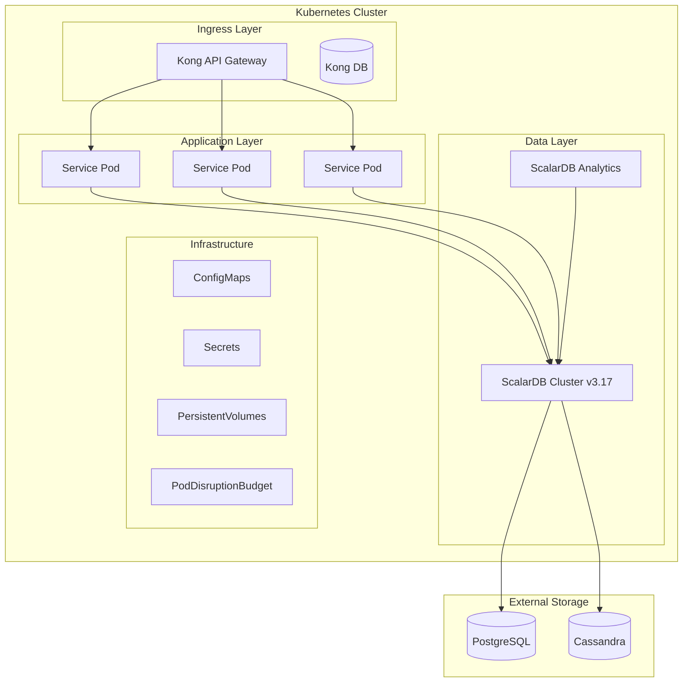

# Infrastructure Design Skill

## 目的

Kubernetes、Kong、ScalarDB Cluster v3.17を使用したインフラストラクチャを設計し、以下を生成します：

- Kubernetesマニフェスト（Deployment, Service, ConfigMap、PodDisruptionBudget等）
- Kong API Gateway設定
- ScalarDB Cluster v3.17設定ファイル（Piggyback Begin / Write Buffering対応）
- インフラ設計書

## 技術スタック



---

## リファレンス資料

設計にあたっては、以下の調査資料とワークフローを参照してください：

### 必須参照ドキュメント

| 資料 | パス | 参照内容 |
|------|------|---------|
| インフラ前提条件 | `research/06_infrastructure_prerequisites.md` | K8s要件、リソース制約、ネットワーク設定 |
| セキュリティ要件 | `research/10_security.md` | 認証・認可、暗号化、Secret管理 |
| 監視設計 | `research/11_observability.md` | メトリクス、ログ、分散トレーシング |
| DR設計 | `research/12_disaster_recovery.md` | バックアップ、リストア、フェイルオーバー |
| ScalarDB v3.17詳細 | `research/13_scalardb_317_deep_dive.md` | v3.17固有機能、制約事項、移行パス |
| 実施手順 | `workflow/07_infrastructure_design.md` | ステップバイステップ手順 |

### アーキテクチャ参照資料

| 資料 | パス | 参照内容 |
|------|------|---------|
| マルチテナントSaaS | `assets/multi-tenant-saas-architecture.md` | テナント分離戦略、マルチテナントK8s設計 |
| API設計 | `assets/api-architecture.md` | API Gateway設計、認証・認可パターン |

### 参照すべきセクション

1. **Kubernetes設計時**:
   - `research/06_infrastructure_prerequisites.md` の K8sリソース要件
   - マルチテナントSaaS資料の「テナント分離」「K8sマルチテナント」セクション
2. **Kong設計時**:
   - `research/10_security.md` の API Gateway セキュリティ
   - API設計資料の「API Gateway」「認証・認可」セクション
3. **ScalarDB設計時**:
   - `research/13_scalardb_317_deep_dive.md` の全セクション（必須）
   - `research/06_infrastructure_prerequisites.md` のストレージ設定
   - マルチテナントSaaS資料の「データ分離戦略」セクション
4. **監視設計時**:
   - `research/11_observability.md` の全セクション
5. **DR設計時**:
   - `research/12_disaster_recovery.md` の全セクション

---

## 実行フロー

### Stage 1: 入力の解析と事前調査

#### 1.1 入力パラメータ

| パラメータ | 必須 | 説明 | デフォルト |
|-----------|------|------|-----------|
| projectName | Yes | プロジェクト名 | - |
| namespace | No | K8s namespace | {projectName} |
| services | Yes | サービス一覧 | - |
| scalardbStorage | No | ストレージ構成 | postgresql + cassandra |
| kongPlugins | No | Kongプラグイン | jwt, rate-limiting |
| enablePiggybackBegin | No | Piggyback Begin有効化 | true (v3.17推奨) |
| enableWriteBuffering | No | Write Buffering有効化 | false (慎重に検討) |

#### 1.2 調査資料の確認

以下のファイルを読み込み、設計要件を抽出：

1. `research/06_infrastructure_prerequisites.md` - リソース制約、前提条件
2. `research/10_security.md` - セキュリティ要件
3. `research/11_observability.md` - 監視要件
4. `research/12_disaster_recovery.md` - DR要件
5. `research/13_scalardb_317_deep_dive.md` - ScalarDB v3.17固有要件

---

### Stage 2: Kubernetes設計

#### 2.1 Namespace定義

```yaml
# k8s/namespace.yaml
apiVersion: v1
kind: Namespace
metadata:
  name: {projectName}
  labels:
    app: {projectName}
    env: production
    scalardb-version: "3.17"
```

#### 2.2 サービス別マニフェスト

各サービスに対して以下を生成：

**Deployment**:
```yaml
# k8s/{service-name}/deployment.yaml
apiVersion: apps/v1
kind: Deployment
metadata:
  name: {service-name}
  namespace: {projectName}
spec:
  replicas: 3
  selector:
    matchLabels:
      app: {service-name}
  template:
    metadata:
      labels:
        app: {service-name}
    spec:
      containers:
        - name: {service-name}
          image: {registry}/{projectName}/{service-name}:latest
          ports:
            - containerPort: 8080
          env:
            - name: SPRING_PROFILES_ACTIVE
              value: "production"
            - name: SCALARDB_CONFIG
              valueFrom:
                configMapKeyRef:
                  name: scalardb-config
                  key: database.properties
          resources:
            requests:
              memory: "512Mi"
              cpu: "250m"
            limits:
              memory: "1Gi"
              cpu: "500m"
          livenessProbe:
            httpGet:
              path: /actuator/health/liveness
              port: 8080
            initialDelaySeconds: 30
            periodSeconds: 10
          readinessProbe:
            httpGet:
              path: /actuator/health/readiness
              port: 8080
            initialDelaySeconds: 10
            periodSeconds: 5
```

**Service**:
```yaml
# k8s/{service-name}/service.yaml
apiVersion: v1
kind: Service
metadata:
  name: {service-name}
  namespace: {projectName}
spec:
  selector:
    app: {service-name}
  ports:
    - port: 80
      targetPort: 8080
  type: ClusterIP
```

**HorizontalPodAutoscaler**:
```yaml
# k8s/{service-name}/hpa.yaml
apiVersion: autoscaling/v2
kind: HorizontalPodAutoscaler
metadata:
  name: {service-name}-hpa
  namespace: {projectName}
spec:
  scaleTargetRef:
    apiVersion: apps/v1
    kind: Deployment
    name: {service-name}
  minReplicas: 3
  maxReplicas: 10
  metrics:
    - type: Resource
      resource:
        name: cpu
        target:
          type: Utilization
          averageUtilization: 70
```

**PodDisruptionBudget** (ScalarDB v3.17推奨):
```yaml
# k8s/{service-name}/pdb.yaml
apiVersion: policy/v1
kind: PodDisruptionBudget
metadata:
  name: {service-name}-pdb
  namespace: {projectName}
spec:
  minAvailable: 2  # 最低2つのPodを常に稼働
  selector:
    matchLabels:
      app: {service-name}
```

---

### Stage 3: Kong API Gateway設計

#### 3.1 Kong Deployment

```yaml
# kong/kong-deployment.yaml
apiVersion: apps/v1
kind: Deployment
metadata:
  name: kong
  namespace: {projectName}-kong
spec:
  replicas: 3
  selector:
    matchLabels:
      app: kong
  template:
    metadata:
      labels:
        app: kong
    spec:
      containers:
        - name: kong
          image: kong:3.4
          ports:
            - containerPort: 8000  # Proxy
            - containerPort: 8001  # Admin API
            - containerPort: 8443  # Proxy SSL
          env:
            - name: KONG_DATABASE
              value: "postgres"
            - name: KONG_PG_HOST
              value: "kong-postgres"
            - name: KONG_PROXY_ACCESS_LOG
              value: "/dev/stdout"
            - name: KONG_ADMIN_ACCESS_LOG
              value: "/dev/stdout"
            - name: KONG_PROXY_ERROR_LOG
              value: "/dev/stderr"
            - name: KONG_ADMIN_ERROR_LOG
              value: "/dev/stderr"
```

#### 3.2 サービスルーティング

```yaml
# kong/services/{service-name}.yaml
apiVersion: configuration.konghq.com/v1
kind: KongIngress
metadata:
  name: {service-name}-ingress
  namespace: {projectName}
spec:
  route:
    strip_path: true
    preserve_host: true
---
apiVersion: networking.k8s.io/v1
kind: Ingress
metadata:
  name: {service-name}-ingress
  namespace: {projectName}
  annotations:
    kubernetes.io/ingress.class: kong
    konghq.com/strip-path: "true"
spec:
  rules:
    - host: api.{domain}
      http:
        paths:
          - path: /{service-path}
            pathType: Prefix
            backend:
              service:
                name: {service-name}
                port:
                  number: 80
```

#### 3.3 Kongプラグイン設定

**JWT認証**:
```yaml
# kong/plugins/jwt.yaml
apiVersion: configuration.konghq.com/v1
kind: KongPlugin
metadata:
  name: jwt-auth
  namespace: {projectName}
plugin: jwt
config:
  secret_is_base64: false
  claims_to_verify:
    - exp
```

**レート制限**:
```yaml
# kong/plugins/rate-limiting.yaml
apiVersion: configuration.konghq.com/v1
kind: KongPlugin
metadata:
  name: rate-limiting
  namespace: {projectName}
plugin: rate-limiting
config:
  minute: 100
  hour: 1000
  policy: local
```

**CORS**:
```yaml
# kong/plugins/cors.yaml
apiVersion: configuration.konghq.com/v1
kind: KongPlugin
metadata:
  name: cors
  namespace: {projectName}
plugin: cors
config:
  origins:
    - "*"
  methods:
    - GET
    - POST
    - PUT
    - DELETE
    - OPTIONS
  headers:
    - Accept
    - Authorization
    - Content-Type
  exposed_headers:
    - X-Auth-Token
  max_age: 3600
```

---

### Stage 4: ScalarDB Cluster v3.17設計

#### 4.1 ScalarDB Cluster設定（v3.17対応）

```properties
# scalardb/scalardb.properties
# ===== Coordinator設定 =====
scalar.db.contact_points=postgresql-coordinator
scalar.db.username=${DB_USER}
scalar.db.password=${DB_PASSWORD}
scalar.db.storage=jdbc
scalar.db.transaction_manager=consensus-commit

# ===== v3.17新機能: Piggyback Begin =====
# Piggyback Beginを有効化（推奨: 性能向上）
scalar.db.consensus_commit.piggyback_begin.enabled=true

# ===== v3.17新機能: Write Buffering =====
# Write Bufferingを有効化（注意: 要件に応じて慎重に検討）
# 有効化する場合のみコメント解除
# scalar.db.consensus_commit.write_buffering.enabled=true
# scalar.db.consensus_commit.write_buffering.buffer_size=1000

# ===== Coordinator Table Protection =====
# Coordinator tableの保護設定（v3.17で推奨）
scalar.db.consensus_commit.coordinator.namespace=coordinator
scalar.db.consensus_commit.coordinator.table_metadata.connection_pool_size=10

# ===== PostgreSQLストレージ設定 =====
scalar.db.multi_storage.storages=postgresql,cassandra

scalar.db.multi_storage.storages.postgresql.storage=jdbc
scalar.db.multi_storage.storages.postgresql.contact_points=postgresql-host
scalar.db.multi_storage.storages.postgresql.username=${POSTGRESQL_USER}
scalar.db.multi_storage.storages.postgresql.password=${POSTGRESQL_PASSWORD}
scalar.db.multi_storage.storages.postgresql.jdbc.connection_pool.min_idle=10
scalar.db.multi_storage.storages.postgresql.jdbc.connection_pool.max_idle=50
scalar.db.multi_storage.storages.postgresql.jdbc.connection_pool.max_total=100

# ===== Cassandraストレージ設定 =====
scalar.db.multi_storage.storages.cassandra.storage=cassandra
scalar.db.multi_storage.storages.cassandra.contact_points=cassandra-host
scalar.db.multi_storage.storages.cassandra.username=${CASSANDRA_USER}
scalar.db.multi_storage.storages.cassandra.password=${CASSANDRA_PASSWORD}
scalar.db.multi_storage.storages.cassandra.replication_strategy=NetworkTopologyStrategy
scalar.db.multi_storage.storages.cassandra.replication_factor=3

# ===== ネームスペースマッピング =====
scalar.db.multi_storage.namespace_mapping={namespace}_postgresql:postgresql,{namespace}_cassandra:cassandra
scalar.db.multi_storage.default_storage=postgresql

# ===== パフォーマンスチューニング =====
scalar.db.consensus_commit.serializable_strategy=EXTRA_READ
scalar.db.consensus_commit.isolation_level=SERIALIZABLE
```

#### 4.2 ScalarDB Cluster Deployment（v3.17）

```yaml
# k8s/scalardb-cluster/deployment.yaml
apiVersion: apps/v1
kind: Deployment
metadata:
  name: scalardb-cluster
  namespace: {projectName}
spec:
  replicas: 3
  selector:
    matchLabels:
      app: scalardb-cluster
  template:
    metadata:
      labels:
        app: scalardb-cluster
        version: "3.17"
    spec:
      containers:
        - name: scalardb-cluster
          image: ghcr.io/scalar-labs/scalardb-cluster-node-byol-standard:3.17.0
          ports:
            - containerPort: 60051
              name: grpc
            - containerPort: 8080
              name: metrics
          env:
            - name: SCALAR_DB_CONFIG_FILE
              value: "/config/scalardb.properties"
            - name: SCALAR_DB_CLUSTER_NODE_PORT
              value: "60051"
            - name: JAVA_OPTS
              value: "-Xms2g -Xmx4g -XX:+UseG1GC"
          volumeMounts:
            - name: config
              mountPath: /config
          resources:
            requests:
              memory: "4Gi"
              cpu: "1000m"
            limits:
              memory: "8Gi"
              cpu: "2000m"
          livenessProbe:
            grpc:
              port: 60051
            initialDelaySeconds: 60
            periodSeconds: 10
          readinessProbe:
            grpc:
              port: 60051
            initialDelaySeconds: 30
            periodSeconds: 5
      volumes:
        - name: config
          configMap:
            name: scalardb-config
```

#### 4.3 ScalarDB Cluster PodDisruptionBudget

```yaml
# k8s/scalardb-cluster/pdb.yaml
apiVersion: policy/v1
kind: PodDisruptionBudget
metadata:
  name: scalardb-cluster-pdb
  namespace: {projectName}
spec:
  minAvailable: 2  # 最低2ノードは常に稼働
  selector:
    matchLabels:
      app: scalardb-cluster
```

#### 4.4 ScalarDB ConfigMap

```yaml
# k8s/scalardb-config.yaml
apiVersion: v1
kind: ConfigMap
metadata:
  name: scalardb-config
  namespace: {projectName}
data:
  scalardb.properties: |
    # Coordinator設定
    scalar.db.contact_points=postgresql-coordinator
    scalar.db.storage=jdbc
    scalar.db.transaction_manager=consensus-commit

    # v3.17機能
    scalar.db.consensus_commit.piggyback_begin.enabled=true

    # Coordinator table保護
    scalar.db.consensus_commit.coordinator.namespace=coordinator

    # Multi-storage設定
    scalar.db.multi_storage.storages=postgresql,cassandra
    # ... 詳細設定
```

#### 4.5 ScalarDB Analytics設定

```properties
# scalardb/scalardb-analytics.properties
# Analytics用設定
scalar.db.sql.enabled=true
scalar.db.sql.connection_mode=direct
scalar.db.sql.default_namespace_name={projectName}

# Spark連携設定（必要な場合）
scalar.db.analytics.spark.master=local[*]
```

#### 4.6 スキーマ定義

```json
// scalardb/schema.json
{
  "{projectName}": {
    "{table_name}": {
      "transaction": true,
      "partition-key": ["{partition_key}"],
      "clustering-key": ["{clustering_key}"],
      "columns": {
        "{column_name}": "{type}"
      }
    }
  }
}
```

---

### Stage 5: 監視・セキュリティ設定

#### 5.1 Prometheus ServiceMonitor（監視設計に基づく）

```yaml
# k8s/monitoring/servicemonitor.yaml
apiVersion: monitoring.coreos.com/v1
kind: ServiceMonitor
metadata:
  name: scalardb-cluster
  namespace: {projectName}
spec:
  selector:
    matchLabels:
      app: scalardb-cluster
  endpoints:
    - port: metrics
      interval: 30s
```

#### 5.2 Secret管理（セキュリティ要件に基づく）

```yaml
# k8s/secrets.yaml
apiVersion: v1
kind: Secret
metadata:
  name: scalardb-credentials
  namespace: {projectName}
type: Opaque
stringData:
  DB_USER: "${DB_USER}"
  DB_PASSWORD: "${DB_PASSWORD}"
  POSTGRESQL_USER: "${POSTGRESQL_USER}"
  POSTGRESQL_PASSWORD: "${POSTGRESQL_PASSWORD}"
  CASSANDRA_USER: "${CASSANDRA_USER}"
  CASSANDRA_PASSWORD: "${CASSANDRA_PASSWORD}"
```

---

### Stage 6: DR設定

#### 6.1 バックアップCronJob（DR設計に基づく）

```yaml
# k8s/backup/cronjob.yaml
apiVersion: batch/v1
kind: CronJob
metadata:
  name: scalardb-backup
  namespace: {projectName}
spec:
  schedule: "0 2 * * *"  # 毎日2時
  jobTemplate:
    spec:
      template:
        spec:
          containers:
            - name: backup
              image: {backup-image}
              env:
                - name: BACKUP_TARGET
                  value: "scalardb"
          restartPolicy: OnFailure
```

---

### Stage 7: 出力

#### 7.1 出力ディレクトリ構造

```
output/phase3/
└── 07_infrastructure_design.md
    ├── k8s/
    │   ├── namespace.yaml
    │   ├── {service-name}/
    │   │   ├── deployment.yaml
    │   │   ├── service.yaml
    │   │   ├── hpa.yaml
    │   │   └── pdb.yaml
    │   ├── scalardb-cluster/
    │   │   ├── deployment.yaml
    │   │   ├── service.yaml
    │   │   └── pdb.yaml
    │   ├── scalardb-config.yaml
    │   ├── secrets.yaml
    │   ├── monitoring/
    │   │   └── servicemonitor.yaml
    │   └── backup/
    │       └── cronjob.yaml
    ├── kong/
    │   ├── kong-deployment.yaml
    │   ├── services/
    │   │   └── {service-name}.yaml
    │   └── plugins/
    │       ├── jwt.yaml
    │       ├── rate-limiting.yaml
    │       └── cors.yaml
    └── scalardb/
        ├── scalardb.properties
        ├── scalardb-analytics.properties
        └── schema.json
```

#### 7.2 インフラ設計書テンプレート

`output/phase3/07_infrastructure_design.md`:

```markdown
# インフラストラクチャ設計書

## 1. 概要

### 技術スタック

| コンポーネント | 技術 | バージョン |
|---------------|------|-----------|
| コンテナ基盤 | Kubernetes | 1.28+ |
| API Gateway | Kong | 3.x |
| データ層 | ScalarDB Cluster | 3.17.x |
| 分析 | ScalarDB Analytics | 3.x |

### ScalarDB v3.17新機能の適用

| 機能 | 適用状況 | 理由 |
|------|---------|------|
| Piggyback Begin | 有効 | トランザクション性能向上 |
| Write Buffering | {有効/無効} | {理由} |
| Coordinator Table保護 | 有効 | 本番環境推奨設定 |

## 2. Kubernetes構成

### 2.1 Namespace

- **{projectName}**: アプリケーションサービス
- **{projectName}-kong**: Kong API Gateway
- **{projectName}-data**: データ層

### 2.2 リソース割り当て

| サービス | CPU Request | CPU Limit | Memory Request | Memory Limit | Replicas |
|---------|-------------|-----------|----------------|--------------|----------|
| ScalarDB Cluster | 1000m | 2000m | 4Gi | 8Gi | 3 |
| {service} | 250m | 500m | 512Mi | 1Gi | 3 |

### 2.3 高可用性設定

- **PodDisruptionBudget**: 全サービスに適用（最低2Pod稼働）
- **HorizontalPodAutoscaler**: CPU使用率70%でスケール
- **Liveness/Readiness Probe**: 全Podに設定

## 3. Kong API Gateway

### 3.1 ルーティング

| パス | サービス | 認証 | レート制限 |
|-----|---------|------|-----------|
| /{path} | {service} | JWT | 100/min |

### 3.2 プラグイン

{plugin_list}

### 3.3 セキュリティ設定

参照: `research/10_security.md`

- JWT認証の実装
- レート制限の設定
- CORS設定

## 4. ScalarDB Cluster v3.17構成

### 4.1 ストレージマッピング

| ネームスペース | ストレージ | 用途 |
|---------------|-----------|------|
| {ns}_postgresql | PostgreSQL | トランザクションデータ |
| {ns}_cassandra | Cassandra | スケーラブルデータ |

### 4.2 v3.17固有設定

#### Piggyback Begin
```properties
scalar.db.consensus_commit.piggyback_begin.enabled=true
```
- トランザクション開始時のネットワークラウンドトリップを削減
- 性能向上が期待できるため有効化

#### Write Buffering
```properties
# 要件に応じて検討
scalar.db.consensus_commit.write_buffering.enabled={true/false}
```
- 有効化判断基準: {判断基準}
- 設定理由: {理由}

#### Coordinator Table保護
```properties
scalar.db.consensus_commit.coordinator.namespace=coordinator
```
- Coordinator tableを専用namespaceで管理
- 本番環境での推奨設定

### 4.3 スキーマ

詳細は `scalardb/schema.json` 参照

{schema_summary}

## 5. 監視設計

参照: `research/11_observability.md`

### 5.1 メトリクス収集

- **Kubernetes**: Prometheus + Grafana
- **Kong**: Kong Prometheus Plugin
- **ScalarDB**: JMX Exporter (port 8080)

### 5.2 ログ収集

- **集約**: Fluentd → Elasticsearch
- **可視化**: Kibana

### 5.3 分散トレーシング

- **OpenTelemetry**: 全サービスに適用
- **バックエンド**: Jaeger / Tempo

## 6. セキュリティ

参照: `research/10_security.md`

### 6.1 認証・認可

- Kong JWT認証
- Service間mTLS（Service Mesh使用時）

### 6.2 Secret管理

- Kubernetes Secret使用
- 外部Secret管理システム連携（推奨）

### 6.3 ネットワークポリシー

- Namespace間通信制限
- Egress制御

## 7. DR（Disaster Recovery）

参照: `research/12_disaster_recovery.md`

### 7.1 バックアップ戦略

- **頻度**: 毎日2時（CronJob）
- **保持期間**: 30日
- **バックアップ先**: {backup_destination}

### 7.2 リストア手順

詳細は `research/12_disaster_recovery.md` 参照

### 7.3 RPO/RTO

- **RPO**: {rpo}
- **RTO**: {rto}

## 8. デプロイ手順

参照: `workflow/07_infrastructure_design.md`

1. Namespaceの作成
2. ConfigMap/Secretの適用
3. ScalarDB Clusterのデプロイ
4. Kongのデプロイ
5. アプリケーションのデプロイ
6. 監視設定の適用
7. バックアップ設定の適用

## 9. インフラ前提条件

参照: `research/06_infrastructure_prerequisites.md`

### 9.1 Kubernetesクラスタ要件

- **バージョン**: 1.28以上
- **ノード数**: 最低3ノード
- **ストレージクラス**: {storage_class}

### 9.2 外部依存

- PostgreSQL: {version}
- Cassandra: {version}

## 10. 運用

### 10.1 スケーリング

- HPA設定により自動スケール
- ScalarDB Clusterは手動スケール推奨

### 10.2 アップデート

- Rolling Update戦略
- PDBによりサービス継続性を保証

### 10.3 トラブルシューティング

監視メトリクスとログを活用した問題切り分け
```

---

## ScalarDB v3.17 固有の注意事項

### Piggyback Begin

**推奨設定**: 有効化（`scalar.db.consensus_commit.piggyback_begin.enabled=true`）

- トランザクション開始時のネットワークラウンドトリップを削減
- 性能向上が期待できる
- 既存の動作に影響なし

### Write Buffering

**慎重な検討が必要**: 要件に応じて判断

有効化する場合:
```properties
scalar.db.consensus_commit.write_buffering.enabled=true
scalar.db.consensus_commit.write_buffering.buffer_size=1000
```

検討ポイント:
- 書き込み性能の向上が期待できる
- メモリ使用量が増加する可能性
- バッファサイズの適切な設定が必要

### Coordinator Table保護

**推奨設定**: 専用namespace使用

```properties
scalar.db.consensus_commit.coordinator.namespace=coordinator
```

- Coordinator tableを誤って削除するリスクを軽減
- 本番環境では必須

### PodDisruptionBudget

**推奨設定**: 全クリティカルサービスに適用

```yaml
spec:
  minAvailable: 2  # 最低2Podは常に稼働
```

- クラスタメンテナンス時のサービス継続性を保証
- ScalarDB Clusterに特に重要

詳細は `research/13_scalardb_317_deep_dive.md` を参照してください。

---

## 使用例

### 例1: 基本的な使い方（v3.17デフォルト設定）

```
Skill: infrastructure-design

- プロジェクト名: pce-backend
- サービス:
  - tenant-service
  - provider-service
  - validation-service
- enablePiggybackBegin: true
- enableWriteBuffering: false
```

### 例2: Write Buffering有効化

```
Skill: infrastructure-design

- プロジェクト名: pce-backend
- namespace: pce-prod
- scalardbStorage: postgresql only
- kongPlugins:
  - jwt
  - rate-limiting
  - cors
  - request-transformer
- enablePiggybackBegin: true
- enableWriteBuffering: true  # 要件に応じて有効化
```

## チェックリスト

設計完了前に以下を確認してください：

- [ ] `research/06_infrastructure_prerequisites.md` の全要件を満たしている
- [ ] `research/10_security.md` のセキュリティ要件を実装している
- [ ] `research/11_observability.md` の監視設計を反映している
- [ ] `research/12_disaster_recovery.md` のDR要件を満たしている
- [ ] `research/13_scalardb_317_deep_dive.md` のv3.17固有設定を適用している
- [ ] PodDisruptionBudgetを全クリティカルサービスに設定している
- [ ] Piggyback Beginの有効化を検討している
- [ ] Write Bufferingの有効化判断を文書化している
- [ ] Coordinator Table保護設定を適用している
- [ ] 出力先が `output/phase3/07_infrastructure_design.md` になっている

## 注意事項

- 本番環境ではSecretの管理に注意してください（`research/10_security.md` 参照）
- ScalarDB Cluster v3.17のスキーマは事前にレビューが必要です
- Kongのプラグイン設定は要件に応じて調整してください（`research/10_security.md` 参照）
- Write Bufferingの有効化は慎重に検討してください（`research/13_scalardb_317_deep_dive.md` 参照）
- PodDisruptionBudgetの設定値はクラスタ規模に応じて調整してください
- 詳細な実施手順は `workflow/07_infrastructure_design.md` を参照してください
