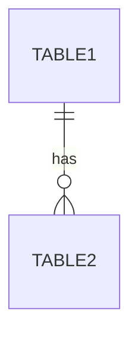

# Step 02: データベース設計

## 目的

Neon（PostgreSQL）データベースのスキーマ設計を行う。

## 担当エージェント

`database-designer`

## 前提条件

- Step 01 完了（`output/01_requirements.md` が存在）

## 参照リソース

- `skills/neon-postgresql-design/SKILL.md`
- `output/01_requirements.md`

## 実行手順

1. 要件定義書の読み込み
2. テーブル設計
   - テーブル一覧
   - カラム定義
   - データ型選択
3. リレーション設計
   - 外部キー制約
   - カーディナリティ
4. インデックス設計
5. DDL生成

## 出力

`output/02_database_design.md`

```markdown
# データベース設計書

## 概要
- データベース: Neon (PostgreSQL)
- 文字コード: UTF-8

## ER図



## テーブル定義

### テーブル名

| カラム | 型 | NULL | デフォルト | 説明 |
|--------|-----|------|-----------|------|
| id | BIGSERIAL | NO | auto-generated | 主キー |

### インデックス

| 名前 | カラム | 種類 |
|------|--------|------|
| PRIMARY | id | PRIMARY KEY |

## DDL

```sql
CREATE TABLE ...
```
```

## 完了条件

- [ ] 全テーブルの定義が完了
- [ ] 外部キー制約が定義されている
- [ ] インデックスが設計されている
- [ ] DDLが生成されている
